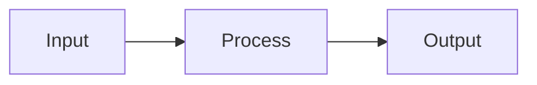

<![CDATA[# 📝 Cheat Sheet Template

<!--
  INSTRUCTIONS:
  1. Copy this file into the appropriate category directory.
  2. Rename it using kebab-case (e.g., singleton-pattern.md).
  3. Fill in every section below.
  4. Delete this instruction block before committing.
-->

> **Category**: `<category-name>` · **Last Updated**: `YYYY-MM-DD` · **Difficulty**: `Beginner | Intermediate | Advanced`

---

## TL;DR

<!-- 2-3 sentence summary. What is this? Why should I care? -->

A one-line summary of the concept and its primary benefit.

---

## 📋 Overview

<!-- Expanded explanation. Cover the "what", "why", and "when to use". -->

Describe the concept in detail:

- **What**: Definition and core idea.
- **Why**: The problem it solves.
- **When**: Situations where this is the right choice.

---

## 🔑 Key Concepts

<!-- Bullet list of essential terms, principles, or components. -->

| Concept       | Description                                |
|---------------|--------------------------------------------|
| Concept A     | Brief explanation of Concept A             |
| Concept B     | Brief explanation of Concept B             |
| Concept C     | Brief explanation of Concept C             |

---

## 📐 Syntax / Visual Diagram

<!-- Use Mermaid, ASCII art, or an embedded image to illustrate structure. -->



---

## 💻 Code Examples

### Basic Usage

```language
// Replace 'language' with the actual language (python, javascript, go, etc.)
// Provide a minimal, runnable example.
```

### Advanced Usage

```language
// A more complex, real-world example.
```

---

## ⚠️ Anti-Patterns

<!-- Common mistakes and what to do instead. -->

| ❌ Anti-Pattern                  | ✅ Better Approach                        |
|----------------------------------|-------------------------------------------|
| Doing X incorrectly              | Do Y instead because...                   |
| Over-engineering with Z          | Keep it simple by using W                 |

---

## 🌍 Real-World Use Case

<!-- A concrete scenario showing this concept in production. -->

**Scenario**: Describe a real-world situation.

**Problem**: What challenge was faced?

**Solution**: How this concept solved it.

**Result**: What was the outcome?

---

## 🔗 Related Topics

<!-- Relative links to other cheat sheets in this repo. -->

- [Related Topic A](../category/related-topic-a.md)
- [Related Topic B](../category/related-topic-b.md)

---

## 📚 References

<!-- External links: official docs, blog posts, papers. -->

- [Official Documentation](https://example.com)
- [Useful Blog Post](https://example.com)

---

*← Back to [Category README](./README.md) · [Root Index](../README.md)*
]]>
