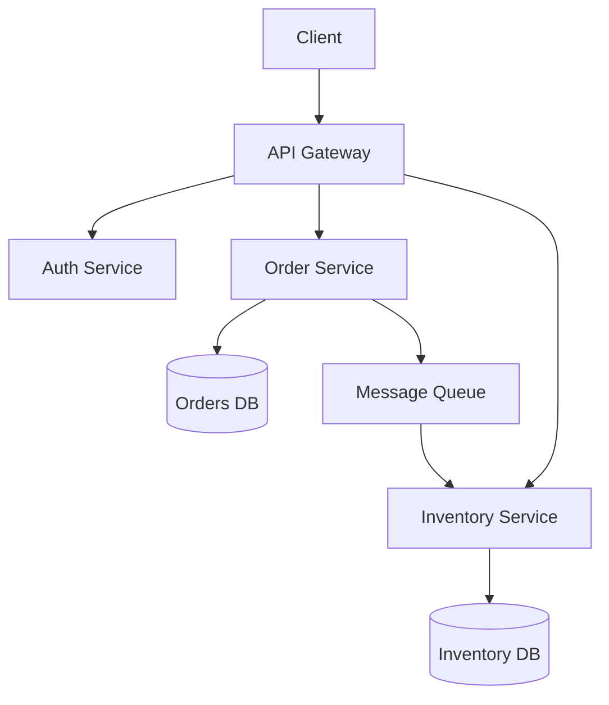

# Microservices Architecture

> **Category**: `architecture` · **Last Updated**: `2026-09-21` · **Difficulty**: `Advanced`

---

## TL;DR

Microservices decompose a monolithic application into small, independently deployable services, each owning its data and communicating via APIs or messaging.

---

## 📋 Overview

- **What**: An architectural style where an application is a collection of loosely coupled services.
- **Why**: Independent scaling, deployment, and technology choices per service.
- **When**: Large teams, complex domains, high-scale systems that need independent release cycles.

---

## 📐 Syntax / Visual Diagram

---

## 🔗 Related Topics

- [Event-Driven Architecture](event-driven.md)
- [Docker](../devops/docker.md)

---

*← Back to [Architecture](./README.md) · [Root Index](../README.md)*

