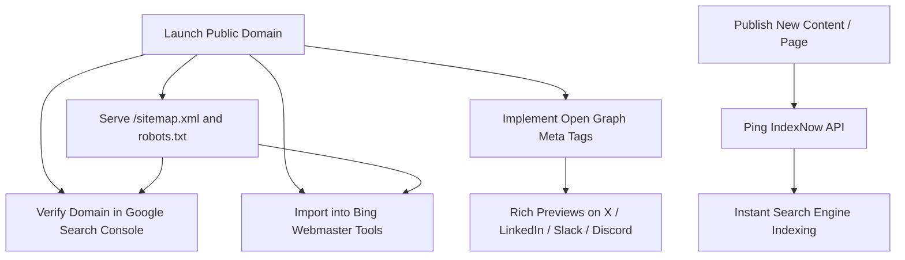

# Launch SEO Checklist

> **Category**: `best-practices` · **Last Updated**: `2026-09-21` · **Difficulty**: `Beginner`

---

## TL;DR

You launched, but nobody is visiting. SEO isn’t magic—it’s an operational checklist. Complete these 5 foundational technical steps (Google Search Console, Bing Webmaster Tools, XML Sitemap, IndexNow, and Open Graph tags) to get indexed immediately and render rich social share cards.

---

## 📋 Overview

- **What**: The essential 5-step post-launch technical SEO and discoverability checklist for web apps, developer portals, and SaaS sites.
- **Why**: Search engines do not instantly know your site exists. Without active registration, sitemaps, and social metadata, your site remains invisible in search results and looks broken or unstyled when shared on social networks.
- **When**: Execute immediately upon deploying your custom domain and launching public traffic.

---

## 🔑 The 5 Essential Launch Steps

| # | Step | Description & Purpose | Setup Time |
|---|---|---|---|
| 1 | **Google Search Console** | Tells Google your site exists; monitors indexing, keywords, and crawl errors. | ~5 min (Free) |
| 2 | **Bing Webmaster Tools** | Captures ~10%+ of global search (Bing, Yahoo, DuckDuckGo); competitors often ignore it. | ~2 min (Import via GSC) |
| 3 | **XML Sitemap** | Directs search engine bots to every valid page on your site to ensure complete crawling. | ~5 min (`/sitemap.xml`) |
| 4 | **IndexNow Protocol** | Pings search engines immediately when you publish or update content for instant indexing. | Automated API call / plugin |
| 5 | **Open Graph (OG) Tags** | Formats social previews (title, image, snippet) when links are shared on Slack, X, LinkedIn. | ~10 min (HTML `<head>`) |

---

## 📐 Discovery & Crawl Pipeline



---

## 💻 Implementation Details & Code Examples

### 1. Google Search Console & Bing Webmaster Tools
- **Google Search Console (GSC)**: Verify ownership via DNS TXT record (recommended) or HTML tag upload. Submit your sitemap URL (`https://yourdomain.com/sitemap.xml`).
- **Bing Webmaster Tools (BWT)**: Use the "Import from Google Search Console" feature for 1-click verification and automated sitemap sync.

---

### 2. XML Sitemap & `robots.txt`

Expose a clean `sitemap.xml` listing your canonical URLs and update timestamps:

```xml
<?xml version="1.0" encoding="UTF-8"?>
<urlset xmlns="http://www.sitemaps.org/schemas/sitemap/0.9">
  <url>
    <loc>https://example.com/</loc>
    <lastmod>2026-09-21</lastmod>
    <changefreq>weekly</changefreq>
    <priority>1.0</priority>
  </url>
  <url>
    <loc>https://example.com/blog/getting-started</loc>
    <lastmod>2026-09-21</lastmod>
    <changefreq>monthly</changefreq>
    <priority>0.8</priority>
  </url>
</urlset>
```

Reference the sitemap in your `robots.txt`:

```txt
User-agent: *
Allow: /

Sitemap: https://example.com/sitemap.xml
```

---

### 3. IndexNow Fast-Indexing Ping

Instead of waiting days for search bots to poll your domain, submit new and updated URLs immediately via the IndexNow HTTP API:

```bash
# Ping IndexNow with updated URL
curl "https://api.indexnow.org/indexnow?url=https://example.com/blog/new-post&key=YOUR_INDEXNOW_KEY"
```

JSON payload submission for bulk updates:

```json
POST https://api.indexnow.org/indexnow
Content-Type: application/json; charset=utf-8

{
  "host": "example.com",
  "key": "YOUR_HEX_API_KEY",
  "keyLocation": "https://example.com/YOUR_HEX_API_KEY.txt",
  "urlList": [
    "https://example.com/blog/new-post",
    "https://example.com/docs/api"
  ]
}
```

---

### 4. Open Graph & Social Preview Tags

Include complete metadata in your HTML `<head>` so links look appealing on Twitter/X, LinkedIn, Facebook, Slack, and Discord:

```html
<!-- Primary Meta Tags -->
<title>Product Name — Supercharge Your Workflow</title>
<meta name="title" content="Product Name — Supercharge Your Workflow" />
<meta name="description" content="Build and ship projects faster with automated intelligence." />

<!-- Open Graph / Facebook / LinkedIn -->
<meta property="og:type" content="website" />
<meta property="og:url" content="https://example.com/" />
<meta property="og:title" content="Product Name — Supercharge Your Workflow" />
<meta property="og:description" content="Build and ship projects faster with automated intelligence." />
<meta property="og:image" content="https://example.com/assets/og-image.png" />

<!-- Twitter / X Cards -->
<meta name="twitter:card" content="summary_large_image" />
<meta name="twitter:url" content="https://example.com/" />
<meta name="twitter:title" content="Product Name — Supercharge Your Workflow" />
<meta name="twitter:description" content="Build and ship projects faster with automated intelligence." />
<meta name="twitter:image" content="https://example.com/assets/og-image.png" />
```

---

## ⚠️ Anti-Patterns & Common Traps

| Trap | Why It Fails | Recommended Fix |
|---|---|---|
| **Staging `robots.txt` in Prod** | Keeping `Disallow: /` blocks all search engines from indexing your production site. | Verify `robots.txt` allows indexing before public announcement. |
| **Relative URLs in `og:image`** | Social crawlers (Slack, X, LinkedIn) require fully qualified absolute URLs (`https://...`). | Always supply full absolute URLs for `og:image` and `og:url`. |
| **Ignoring Bing & DuckDuckGo** | Missing out on ~10%+ of global searches and enterprise desktop users. | Import Google Search Console directly into Bing Webmaster Tools in 1 minute. |
| **No IndexNow Trigger** | Waiting days or weeks for crawlers to discover newly launched articles. | Automate IndexNow pings on deployment or CMS publish events. |
| **Missing Canonical Links** | Duplicate content penalties when site is accessible via `http://`, `https://`, `www.`, and non-`www.`. | Enforce single canonical redirect and specify `<link rel="canonical" href="..." />`. |

---

*← Back to [Best Practices](./README.md) · [Root Index](../README.md)*
