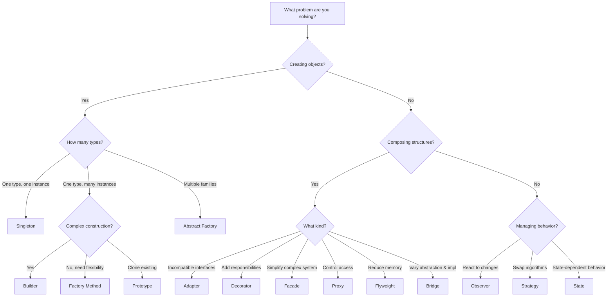

# 🎨 Design Patterns

> Reusable solutions to common software design problems, organized by the Gang of Four (GoF) classification.

---

## 📋 Overview

Design patterns are essential tools that offer **reusable solutions to common problems** in software design. They provide a proven framework for writing efficient, maintainable, and scalable code. By leveraging these patterns, developers can streamline the development process and improve code readability and reliability.

Design patterns are categorized into three main types based on their purpose:

| Category       | Purpose                                              | Count |
|---------------|------------------------------------------------------|-------|
| 🏗️ **Creational** | Deal with object creation mechanisms                | 5     |
| 🧱 **Structural** | Focus on object composition and structure           | 6     |
| 🔄 **Behavioral** | Manage object interaction and communication         | 3     |

---

## 🏗️ Creational Patterns

> Deal with object creation mechanisms, hiding instantiation details and making the system independent of how its objects are created.

| #  | Pattern           | Description                                                    | Difficulty     | Path                                          |
|----|-------------------|----------------------------------------------------------------|----------------|-----------------------------------------------|
| 1  | Singleton         | Ensures a class has only one instance with global access       | Beginner       | [singleton.md](singleton.md)                  |
| 2  | Factory Method    | Defines interface for creating objects, letting subclasses decide | Intermediate | [factory-method.md](factory-method.md)        |
| 3  | Abstract Factory  | Creates families of related objects without concrete classes   | Advanced       | [abstract-factory.md](abstract-factory.md)    |
| 4  | Builder           | Separates complex object construction from representation     | Intermediate   | [builder.md](builder.md)                      |
| 5  | Prototype         | Creates new objects by cloning existing ones                   | Intermediate   | [prototype.md](prototype.md)                  |

---

## 🧱 Structural Patterns

> Focus on how classes and objects can be combined to form larger, more flexible, and efficient structures.

| #  | Pattern    | Description                                                      | Difficulty     | Path                                    |
|----|-----------|------------------------------------------------------------------|----------------|-----------------------------------------|
| 6  | Adapter   | Converts one interface into another that clients expect          | Intermediate   | [adapter.md](adapter.md)                |
| 7  | Bridge    | Decouples abstraction from implementation                        | Advanced       | [bridge.md](bridge.md)                  |
| 8  | Decorator | Adds behavior to objects dynamically without altering structure  | Intermediate   | [decorator.md](decorator.md)            |
| 9  | Facade    | Provides a simplified interface to a complex subsystem           | Beginner       | [facade.md](facade.md)                  |
| 10 | Flyweight | Reduces memory usage by sharing common data among objects        | Advanced       | [flyweight.md](flyweight.md)            |
| 11 | Proxy     | Controls and manages access to another object                    | Intermediate   | [proxy.md](proxy.md)                    |

---

## 🔄 Behavioral Patterns

> Manage responsibilities and complex control flows between objects, defining how objects interact and communicate.

| #  | Pattern    | Description                                                       | Difficulty     | Path                                    |
|----|-----------|-------------------------------------------------------------------|----------------|-----------------------------------------|
| 12 | Observer  | Defines one-to-many dependency for automatic state notifications  | Intermediate   | [observer.md](observer.md)              |
| 13 | Strategy  | Defines a family of interchangeable algorithms                    | Intermediate   | [strategy.md](strategy.md)              |
| 14 | State     | Allows an object to alter behavior when internal state changes    | Advanced       | [state.md](state.md)                    |

---

## 🗺️ Pattern Selection Guide

---

## 📚 References

- [GeeksforGeeks — Design Patterns Use Cases](https://www.geeksforgeeks.org/system-design/design-patterns-use-cases/)
- [Refactoring Guru — Design Patterns](https://refactoring.guru/design-patterns)
- [Gang of Four — Design Patterns: Elements of Reusable Object-Oriented Software (1994)](https://en.wikipedia.org/wiki/Design_Patterns)

---

*← Back to [Root Index](../README.md)*
<parameter name="Description">Completely rewritten design-patterns README with all 14 patterns organized by GoF classification (Creational, Structural, Behavioral), including a Mermaid pattern selection flowchart.
