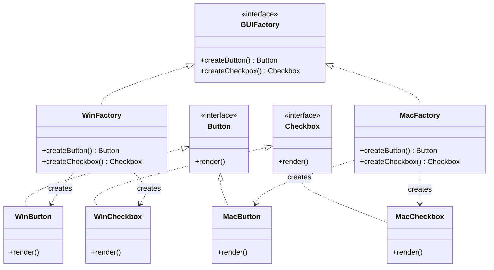

# Abstract Factory Pattern

> **Category**: `design-patterns / creational` · **Last Updated**: `2026-09-21` · **Difficulty**: `Advanced`

---

## TL;DR

The Abstract Factory provides an interface for creating **families of related or dependent objects** without specifying their concrete classes. Think of it as a "factory of factories."

---

## 📋 Overview

- **What**: A creational pattern that encapsulates a group of individual factories that have a common theme, without specifying their concrete classes.
- **Why**: Ensures that the created objects are compatible with each other (e.g., all UI components match the same OS theme).
- **When**: When the system needs to be independent of how its products are created, and you need to work with multiple families of products.

---

## 🔑 Key Concepts

| Concept               | Description                                                     |
|-----------------------|-----------------------------------------------------------------|
| Abstract Factory      | Interface declaring creation methods for each product type      |
| Concrete Factory      | Implements creation methods for a specific product family        |
| Abstract Product      | Interface for a type of product                                  |
| Concrete Product      | Specific implementation belonging to a family                    |

---

## 📐 Syntax / Visual Diagram



---

## 💻 Code Examples

### Python

```python
from abc import ABC, abstractmethod

# Abstract Products
class Button(ABC):
    @abstractmethod
    def render(self) -> str: ...

class Checkbox(ABC):
    @abstractmethod
    def render(self) -> str: ...

# Concrete Products — Windows Family
class WinButton(Button):
    def render(self) -> str: return "[Windows Button]"

class WinCheckbox(Checkbox):
    def render(self) -> str: return "[Windows Checkbox]"

# Concrete Products — macOS Family
class MacButton(Button):
    def render(self) -> str: return "(Mac Button)"

class MacCheckbox(Checkbox):
    def render(self) -> str: return "(Mac Checkbox)"

# Abstract Factory
class GUIFactory(ABC):
    @abstractmethod
    def create_button(self) -> Button: ...
    @abstractmethod
    def create_checkbox(self) -> Checkbox: ...

# Concrete Factories
class WinFactory(GUIFactory):
    def create_button(self) -> Button: return WinButton()
    def create_checkbox(self) -> Checkbox: return WinCheckbox()

class MacFactory(GUIFactory):
    def create_button(self) -> Button: return MacButton()
    def create_checkbox(self) -> Checkbox: return MacCheckbox()

# Client — works with any factory
def build_ui(factory: GUIFactory):
    btn = factory.create_button()
    chk = factory.create_checkbox()
    print(btn.render(), chk.render())

build_ui(WinFactory())  # [Windows Button] [Windows Checkbox]
build_ui(MacFactory())  # (Mac Button) (Mac Checkbox)
```

---

## ⚠️ Anti-Patterns

| ❌ Anti-Pattern                                    | ✅ Better Approach                                  |
|----------------------------------------------------|-----------------------------------------------------|
| Mixing products from different families            | Each factory must produce a consistent family        |
| Adding new product types to existing factories     | Use the pattern only when product families are stable|
| Using Abstract Factory when you have one product   | Use simple Factory Method instead                    |

---

## 🌍 Real-World Use Cases

| Use Case                      | Description                                                     |
|-------------------------------|-----------------------------------------------------------------|
| **Cross-Platform UI Toolkits**| Windows, macOS, Linux — each has matching button/menu/dialog    |
| **Database Abstraction**      | MySQL, PostgreSQL, SQLite — each produces matching connection/query/result objects |
| **Theme Systems**             | Dark theme, Light theme — each produces matching color/font/icon families |
| **Payment Gateways**          | Stripe, PayPal — each produces matching charge/refund/webhook objects |

---

## ⚖️ Advantages vs Disadvantages

| ✅ Advantages                              | ❌ Disadvantages                                |
|--------------------------------------------|------------------------------------------------|
| Ensures product compatibility              | Difficult to add new product types             |
| Isolates concrete classes from clients     | Increased complexity and number of classes      |
| Easy to swap entire product families       | Can be overkill for simple scenarios           |
| Promotes consistency across products       | Requires parallel hierarchies                   |

---

## 🔗 Related Topics

- [Factory Method](factory-method.md) — Abstract Factory is often implemented using Factory Methods
- [Singleton](singleton.md) — Concrete factories are often Singletons
- [Builder](builder.md) — Can work together with Abstract Factory
- [Prototype](prototype.md) — Can be used instead of Abstract Factory

---

## 📚 References

- [GeeksforGeeks — Abstract Factory Pattern](https://www.geeksforgeeks.org/abstract-factory-pattern/)
- [Refactoring Guru — Abstract Factory](https://refactoring.guru/design-patterns/abstract-factory)

---

*← Back to [Design Patterns](./README.md) · [Root Index](../README.md)*
