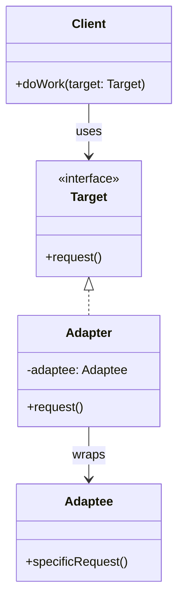

# Adapter Pattern

> **Category**: `design-patterns / structural` · **Last Updated**: `2026-09-21` · **Difficulty**: `Intermediate`

---

## TL;DR

The Adapter pattern allows **incompatible interfaces to work together** by wrapping an existing class with a new interface that the client expects. It acts as a translator between two incompatible systems.

---

## 📋 Overview

- **What**: A structural pattern that converts the interface of a class into another interface clients expect.
- **Why**: Allows classes with incompatible interfaces to collaborate without modifying their source code.
- **When**: When you want to use an existing class but its interface doesn't match what you need, or when integrating third-party libraries.

---

## 🔑 Key Concepts

| Concept       | Description                                                          |
|---------------|----------------------------------------------------------------------|
| Target        | The interface the client expects                                     |
| Adaptee       | The existing class with an incompatible interface                    |
| Adapter       | Wraps the Adaptee and implements the Target interface                |
| Object Adapter| Uses composition (wraps the adaptee object)                          |
| Class Adapter | Uses inheritance (extends the adaptee class) — less common           |

---

## 📐 Syntax / Visual Diagram



---

## 💻 Code Examples

### Python — Payment Gateway Adapter

```python
from abc import ABC, abstractmethod

# Target interface your app expects
class PaymentProcessor(ABC):
    @abstractmethod
    def pay(self, amount: float) -> str: ...

# Adaptee — legacy third-party payment system
class LegacyPayPal:
    def make_payment(self, payment_data: dict) -> bool:
        print(f"PayPal processing ${payment_data['total']}")
        return True

# Adapter — bridges the gap
class PayPalAdapter(PaymentProcessor):
    def __init__(self, paypal: LegacyPayPal):
        self._paypal = paypal
    
    def pay(self, amount: float) -> str:
        payment_data = {"total": amount, "currency": "USD"}
        success = self._paypal.make_payment(payment_data)
        return "Payment successful" if success else "Payment failed"

# Client code — works with the Target interface
def checkout(processor: PaymentProcessor, amount: float):
    result = processor.pay(amount)
    print(result)

# Usage
legacy_paypal = LegacyPayPal()
adapter = PayPalAdapter(legacy_paypal)
checkout(adapter, 99.99)
```

---

## ⚠️ Anti-Patterns

| ❌ Anti-Pattern                                 | ✅ Better Approach                                   |
|-------------------------------------------------|------------------------------------------------------|
| Modifying the Adaptee's source code             | Wrap it with an Adapter instead                      |
| Adapter with too much business logic            | Keep adapters thin — translate only                   |
| Creating adapters for compatible interfaces     | Only adapt when interfaces truly don't match          |

---

## 🌍 Real-World Use Cases

| Use Case                      | Description                                                      |
|-------------------------------|------------------------------------------------------------------|
| **Legacy System Integration** | Wrapping old APIs to work with new application code              |
| **Third-Party Library Wrapping**| Adapting Stripe/PayPal/Twilio SDKs to your internal interface  |
| **Data Format Conversion**    | XML-to-JSON adapters, CSV-to-database adapters                   |
| **Hardware Abstraction**      | Uniform interface for different device drivers                    |
| **Plug Adapters (Physical)**  | Like a US-to-EU power adapter — same concept!                   |

---

## 🔗 Related Topics

- [Bridge](bridge.md) — Designed up-front; Adapter fixes after the fact
- [Decorator](decorator.md) — Adds behavior; Adapter changes interface
- [Facade](facade.md) — Simplifies; Adapter makes compatible
- [Proxy](proxy.md) — Same interface; Adapter different interface

---

## 📚 References

- [GeeksforGeeks — Adapter Pattern](https://www.geeksforgeeks.org/adapter-pattern/)
- [Refactoring Guru — Adapter](https://refactoring.guru/design-patterns/adapter)

---

*← Back to [Design Patterns](./README.md) · [Root Index](../README.md)*
