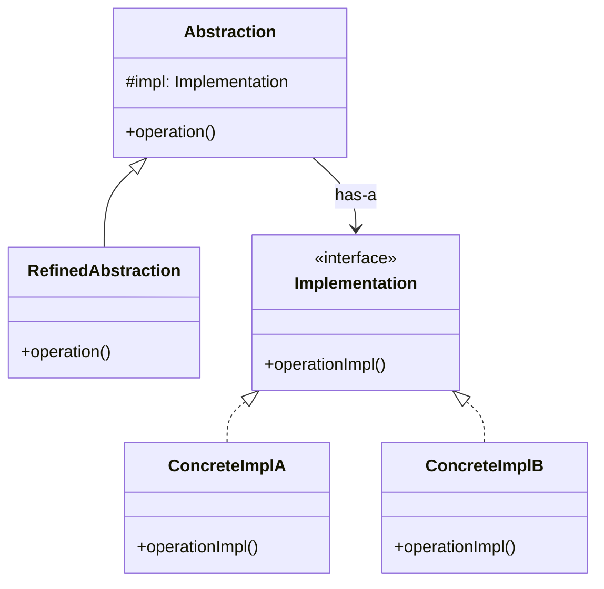

# Bridge Pattern

> **Category**: `design-patterns / structural` · **Last Updated**: `2026-09-21` · **Difficulty**: `Advanced`

---

## TL;DR

The Bridge pattern **decouples an abstraction from its implementation** so that the two can vary independently. It prevents a "cartesian product" explosion of classes when you have multiple dimensions of variation.

---

## 📋 Overview

- **What**: A structural pattern that splits a large class or set of closely related classes into two separate hierarchies — abstraction and implementation — which can be developed independently.
- **Why**: Avoids class explosion when multiple dimensions of variation combine (e.g., Shape × Color = many classes).
- **When**: When you need to extend a class in several independent dimensions, or when you want to switch implementations at runtime.

---

## 📐 Syntax / Visual Diagram



---

## 💻 Code Examples

### Python — Device Remote Control

```python
from abc import ABC, abstractmethod

# Implementation hierarchy
class Device(ABC):
    @abstractmethod
    def power_on(self): ...
    @abstractmethod
    def power_off(self): ...
    @abstractmethod
    def set_channel(self, channel: int): ...

class TV(Device):
    def power_on(self): print("📺 TV is ON")
    def power_off(self): print("📺 TV is OFF")
    def set_channel(self, ch): print(f"📺 TV channel → {ch}")

class Radio(Device):
    def power_on(self): print("📻 Radio is ON")
    def power_off(self): print("📻 Radio is OFF")
    def set_channel(self, ch): print(f"📻 Radio freq → {ch}")

# Abstraction hierarchy
class RemoteControl:
    def __init__(self, device: Device):
        self._device = device
    
    def toggle_power(self): self._device.power_on()
    def channel_up(self): pass

class AdvancedRemote(RemoteControl):
    def mute(self): print("🔇 Muted")
    def set_channel(self, ch): self._device.set_channel(ch)

# Usage — any remote works with any device
tv_remote = AdvancedRemote(TV())
tv_remote.toggle_power()      # 📺 TV is ON
tv_remote.set_channel(5)      # 📺 TV channel → 5

radio_remote = RemoteControl(Radio())
radio_remote.toggle_power()   # 📻 Radio is ON
```

---

## 🌍 Real-World Use Cases

| Use Case                      | Description                                                     |
|-------------------------------|-----------------------------------------------------------------|
| **Cross-Platform Graphics**   | Shape abstraction × Rendering implementation (OpenGL, DirectX)  |
| **Database Drivers**          | Query abstraction × DB driver (MySQL, PostgreSQL, SQLite)        |
| **Remote Controls**           | Remote type × Device type (TV, Radio, Smart Home)                |
| **Messaging Systems**         | Message format × Transport protocol (HTTP, WebSocket, gRPC)     |

---

## 🔗 Related Topics

- [Adapter](adapter.md) — Fixes incompatibility after design; Bridge prevents it by design
- [Strategy](strategy.md) — Similar delegation but Strategy is behavioral
- [Abstract Factory](abstract-factory.md) — Can create Bridge components

---

## 📚 References

- [GeeksforGeeks — Bridge Design Pattern](https://www.geeksforgeeks.org/bridge-design-pattern/)
- [Refactoring Guru — Bridge](https://refactoring.guru/design-patterns/bridge)

---

*← Back to [Design Patterns](./README.md) · [Root Index](../README.md)*
