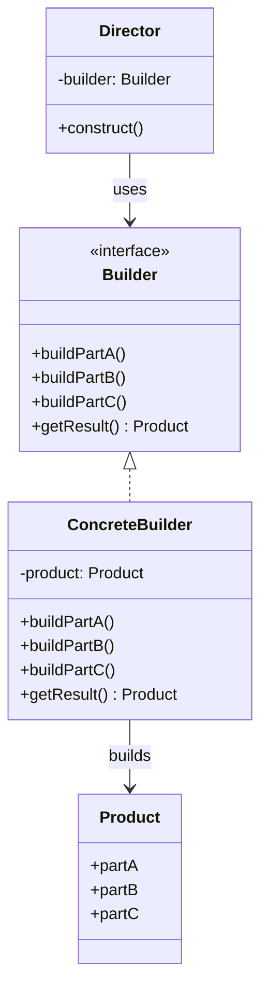

# Builder Pattern

> **Category**: `design-patterns / creational` · **Last Updated**: `2026-09-21` · **Difficulty**: `Intermediate`

---

## TL;DR

The Builder pattern separates the **construction of a complex object** from its representation, allowing the same construction process to create different representations. It solves the "telescoping constructor" problem.

---

## 📋 Overview

- **What**: A creational pattern that constructs complex objects step by step, allowing you to produce different types and representations using the same construction code.
- **Why**: Avoids constructors with dozens of optional parameters (telescoping constructors) and makes object creation readable and flexible.
- **When**: When an object has many optional parameters, when construction involves multiple steps, or when you need different representations of the same object.

---

## 🔑 Key Concepts

| Concept          | Description                                                        |
|------------------|--------------------------------------------------------------------|
| Builder          | Interface defining all construction steps                          |
| Concrete Builder | Implements the construction steps for a specific representation    |
| Director         | Defines the order of construction steps (optional)                 |
| Product          | The complex object being built                                     |
| Fluent Interface  | Method chaining via `return self` for readable construction       |

---

## 📐 Syntax / Visual Diagram



---

## 💻 Code Examples

### Python — Fluent Builder

```python
class Pizza:
    def __init__(self):
        self.size = None
        self.cheese = False
        self.pepperoni = False
        self.mushrooms = False
        self.onions = False
    
    def __str__(self):
        toppings = [t for t, v in [
            ("cheese", self.cheese), ("pepperoni", self.pepperoni),
            ("mushrooms", self.mushrooms), ("onions", self.onions)
        ] if v]
        return f"{self.size} pizza with {', '.join(toppings) or 'no toppings'}"

class PizzaBuilder:
    def __init__(self):
        self._pizza = Pizza()
    
    def size(self, size: str) -> "PizzaBuilder":
        self._pizza.size = size
        return self
    
    def add_cheese(self) -> "PizzaBuilder":
        self._pizza.cheese = True
        return self
    
    def add_pepperoni(self) -> "PizzaBuilder":
        self._pizza.pepperoni = True
        return self
    
    def add_mushrooms(self) -> "PizzaBuilder":
        self._pizza.mushrooms = True
        return self
    
    def add_onions(self) -> "PizzaBuilder":
        self._pizza.onions = True
        return self
    
    def build(self) -> Pizza:
        return self._pizza

# Usage — fluent method chaining
pizza = (PizzaBuilder()
    .size("Large")
    .add_cheese()
    .add_pepperoni()
    .add_mushrooms()
    .build())

print(pizza)  # Large pizza with cheese, pepperoni, mushrooms
```

### Java

```java
public class User {
    private final String name;       // required
    private final String email;      // required
    private final int age;           // optional
    private final String phone;      // optional
    
    private User(Builder builder) {
        this.name = builder.name;
        this.email = builder.email;
        this.age = builder.age;
        this.phone = builder.phone;
    }
    
    public static class Builder {
        private final String name;
        private final String email;
        private int age = 0;
        private String phone = "";
        
        public Builder(String name, String email) {
            this.name = name;
            this.email = email;
        }
        
        public Builder age(int age) {
            this.age = age;
            return this;
        }
        
        public Builder phone(String phone) {
            this.phone = phone;
            return this;
        }
        
        public User build() {
            return new User(this);
        }
    }
}

// Usage
User user = new User.Builder("Alice", "alice@example.com")
    .age(30)
    .phone("+1-555-0100")
    .build();
```

---

## ⚠️ Anti-Patterns

| ❌ Anti-Pattern                                | ✅ Better Approach                                  |
|------------------------------------------------|-----------------------------------------------------|
| Telescoping constructors with 10+ parameters   | Use Builder to name each parameter explicitly        |
| Mutable builders that can be reused unsafely   | Create a new builder for each product instance       |
| Builder without a `build()` method             | Always have an explicit finalization step             |
| Using Builder for simple objects (2-3 fields)  | Only use when construction is genuinely complex      |

---

## 🌍 Real-World Use Cases

| Use Case                     | Description                                                    |
|------------------------------|----------------------------------------------------------------|
| **HTTP Request Builders**    | `HttpRequest.newBuilder().uri(...).GET().build()`              |
| **SQL Query Builders**       | Constructing complex queries step by step                      |
| **UI Layout Builders**       | Composing complex layouts with many optional properties         |
| **Configuration Objects**    | Building config with many optional settings                     |
| **Meal/Order Builders**      | Fast food: burger + drink + side + extras                       |
| **Document Generators**      | Building PDF/HTML reports with headers, tables, footers         |

---

## ⚖️ Advantages vs Disadvantages

| ✅ Advantages                              | ❌ Disadvantages                                |
|--------------------------------------------|------------------------------------------------|
| Readable, self-documenting construction    | More code than simple constructors              |
| Immutable objects via builder              | Requires a separate Builder class               |
| Eliminates telescoping constructors        | Duplicated fields between builder and product   |
| Step-by-step construction                  | Can be overkill for simple objects              |

---

## 🔗 Related Topics

- [Abstract Factory](abstract-factory.md) — Can use Builder to construct complex products
- [Singleton](singleton.md) — Builder's Director can be a Singleton
- [Factory Method](factory-method.md) — Both create objects but Builder does it step-by-step
- [Prototype](prototype.md) — Alternative when construction involves many steps

---

## 📚 References

- [GeeksforGeeks — Builder Design Pattern](https://www.geeksforgeeks.org/builder-design-pattern/)
- [Refactoring Guru — Builder](https://refactoring.guru/design-patterns/builder)

---

*← Back to [Design Patterns](./README.md) · [Root Index](../README.md)*
