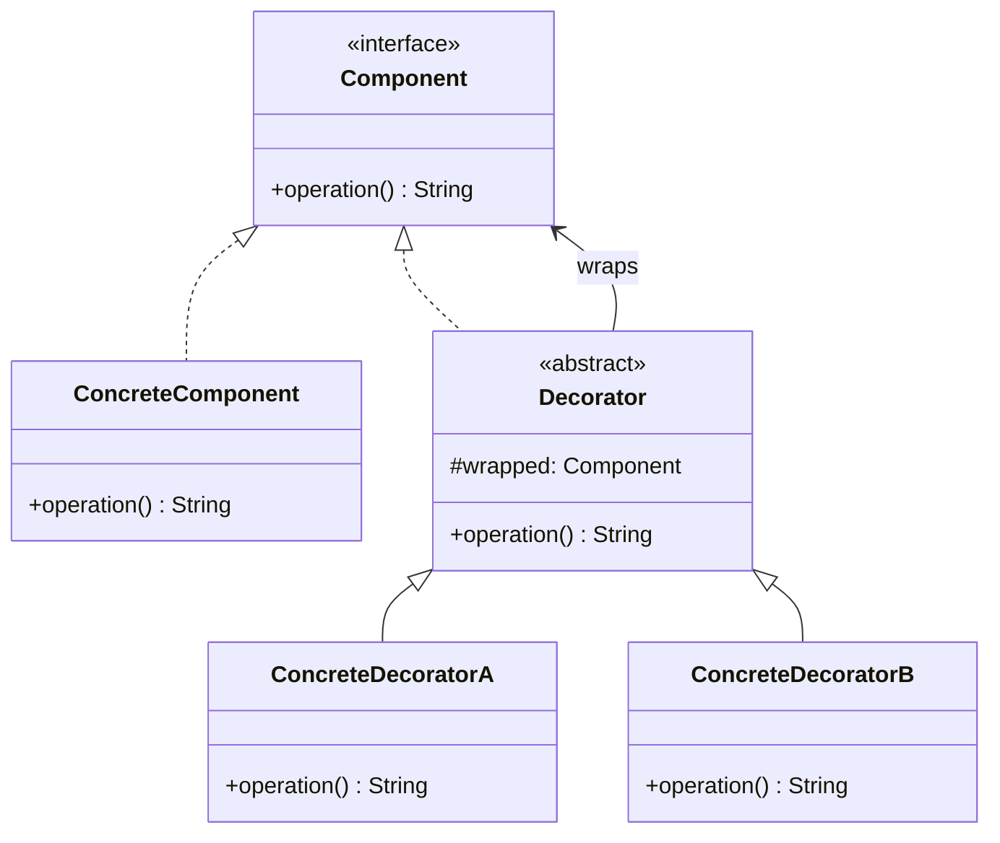

# Decorator Pattern

> **Category**: `design-patterns / structural` · **Last Updated**: `2026-09-21` · **Difficulty**: `Intermediate`

---

## TL;DR

The Decorator pattern **adds behavior or responsibilities to an object dynamically** without altering its structure. It wraps the original object with decorator objects that extend its functionality.

---

## 📋 Overview

- **What**: A structural pattern that attaches additional responsibilities to an object dynamically by wrapping it in a decorator class.
- **Why**: Provides a flexible alternative to subclassing for extending functionality — you can combine decorators at runtime.
- **When**: When you need to add behavior to individual objects (not entire classes), or when extension by subclassing is impractical due to many possible combinations.

---

## 📐 Syntax / Visual Diagram



---

## 💻 Code Examples

### Python — Coffee Shop

```python
from abc import ABC, abstractmethod

class Coffee(ABC):
    @abstractmethod
    def cost(self) -> float: ...
    @abstractmethod
    def description(self) -> str: ...

class SimpleCoffee(Coffee):
    def cost(self) -> float: return 2.00
    def description(self) -> str: return "Simple coffee"

# Decorator base
class CoffeeDecorator(Coffee):
    def __init__(self, coffee: Coffee):
        self._coffee = coffee

class MilkDecorator(CoffeeDecorator):
    def cost(self) -> float: return self._coffee.cost() + 0.50
    def description(self) -> str: return self._coffee.description() + " + milk"

class WhipDecorator(CoffeeDecorator):
    def cost(self) -> float: return self._coffee.cost() + 0.70
    def description(self) -> str: return self._coffee.description() + " + whip"

class VanillaDecorator(CoffeeDecorator):
    def cost(self) -> float: return self._coffee.cost() + 0.60
    def description(self) -> str: return self._coffee.description() + " + vanilla"

# Usage — stack decorators dynamically
order = VanillaDecorator(WhipDecorator(MilkDecorator(SimpleCoffee())))
print(f"{order.description()} = ${order.cost():.2f}")
# Simple coffee + milk + whip + vanilla = $3.80
```

---

## ⚠️ Anti-Patterns

| ❌ Anti-Pattern                              | ✅ Better Approach                                |
|----------------------------------------------|---------------------------------------------------|
| Deep nesting of many decorators              | Consider Builder or configuration objects instead |
| Decorators that remove base behavior         | Decorators should only ADD, never remove           |
| Relying on specific decorator order          | Design decorators to be order-independent          |

---

## 🌍 Real-World Use Cases

| Use Case                     | Description                                                     |
|------------------------------|-----------------------------------------------------------------|
| **Java I/O Streams**         | `BufferedReader(InputStreamReader(FileInputStream(...)))`        |
| **Middleware/Interceptors**  | Auth → Logging → Compression → Request Handler                  |
| **UI Component Styling**     | ScrollDecorator(BorderDecorator(TextComponent))                  |
| **Data Encryption Layers**   | Compress → Encrypt → Encode — each wraps the previous           |
| **Python `@decorators`**     | `@login_required`, `@cache`, `@retry` — function wrappers       |

---

## 🔗 Related Topics

- [Adapter](adapter.md) — Changes interface; Decorator enhances behavior
- [Proxy](proxy.md) — Controls access; Decorator adds responsibility
- [Strategy](strategy.md) — Swaps algorithm internals; Decorator wraps externally
- [Facade](facade.md) — Simplifies; Decorator enriches

---

## 📚 References

- [GeeksforGeeks — Decorator Pattern](https://www.geeksforgeeks.org/decorator-pattern/)
- [Refactoring Guru — Decorator](https://refactoring.guru/design-patterns/decorator)

---

*← Back to [Design Patterns](./README.md) · [Root Index](../README.md)*
