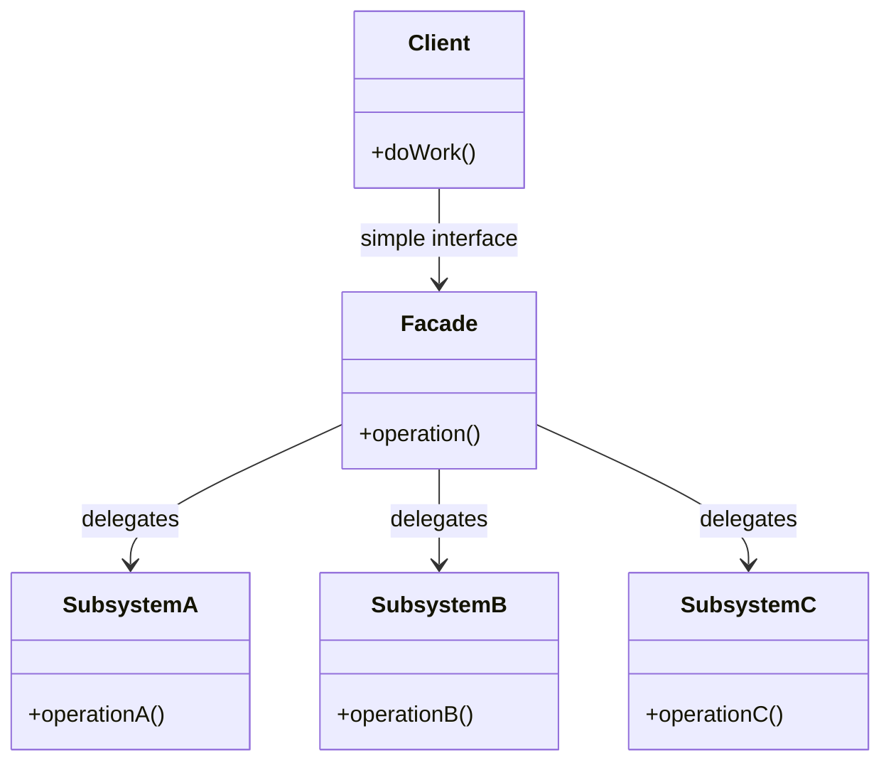

# Facade Pattern

> **Category**: `design-patterns / structural` · **Last Updated**: `2026-09-21` · **Difficulty**: `Beginner`

---

## TL;DR

The Facade pattern provides a **simplified interface** to a complex subsystem. It hides the complexity behind a single, easy-to-use class.

---

## 📋 Overview

- **What**: A structural pattern that provides a unified, higher-level interface that makes a complex subsystem easier to use.
- **Why**: Reduces coupling between clients and subsystem components, making the system easier to understand and use.
- **When**: When you need a simple interface to a complex system, when there are many interdependent classes, or when you want to layer your subsystems.

---

## 📐 Syntax / Visual Diagram



---

## 💻 Code Examples

### Python — Home Theater Facade

```python
class Amplifier:
    def on(self): print("🔊 Amplifier ON")
    def set_volume(self, level): print(f"🔊 Volume → {level}")

class DVDPlayer:
    def on(self): print("📀 DVD Player ON")
    def play(self, movie): print(f"📀 Playing: {movie}")

class Projector:
    def on(self): print("🎥 Projector ON")
    def wide_screen(self): print("🎥 Widescreen mode")

class Lights:
    def dim(self, level): print(f"💡 Lights dimmed to {level}%")

# Facade — one method instead of 7 calls
class HomeTheaterFacade:
    def __init__(self):
        self.amp = Amplifier()
        self.dvd = DVDPlayer()
        self.projector = Projector()
        self.lights = Lights()
    
    def watch_movie(self, movie: str):
        print("🎬 Get ready to watch a movie...")
        self.lights.dim(10)
        self.projector.on()
        self.projector.wide_screen()
        self.amp.on()
        self.amp.set_volume(7)
        self.dvd.on()
        self.dvd.play(movie)

# Usage — one call does everything
theater = HomeTheaterFacade()
theater.watch_movie("Inception")
```

---

## 🌍 Real-World Use Cases

| Use Case                     | Description                                                     |
|------------------------------|-----------------------------------------------------------------|
| **Library Wrappers**         | jQuery wraps complex DOM APIs into `$()` calls                   |
| **Compiler Subsystems**      | `compile()` hides lexing, parsing, optimization, code generation|
| **Order Processing**         | `placeOrder()` hides inventory, payment, shipping, notification |
| **Cloud SDKs**               | AWS SDK wraps HTTP signing, retries, serialization               |
| **ORM Frameworks**           | `Model.find()` hides SQL generation, connection, mapping         |

---

## 🔗 Related Topics

- [Adapter](adapter.md) — Makes incompatible interfaces work; Facade simplifies
- [Singleton](singleton.md) — Facades are often singletons
- [Decorator](decorator.md) — Adds behavior; Facade reduces interface
- [Proxy](proxy.md) — Controls access to one object; Facade wraps a subsystem

---

## 📚 References

- [GeeksforGeeks — Facade Design Pattern](https://www.geeksforgeeks.org/facade-design-pattern-introduction/)
- [Refactoring Guru — Facade](https://refactoring.guru/design-patterns/facade)

---

*← Back to [Design Patterns](./README.md) · [Root Index](../README.md)*
