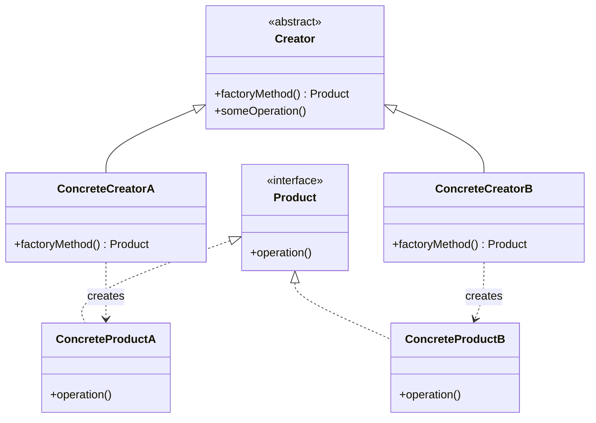

# Factory Method Pattern

> **Category**: `design-patterns / creational` · **Last Updated**: `2026-09-21` · **Difficulty**: `Intermediate`

---

## TL;DR

The Factory Method defines an interface for creating objects but **lets subclasses decide** which class to instantiate. It promotes loose coupling by eliminating direct `new` calls and delegating object creation to specialized factory methods.

---

## 📋 Overview

- **What**: A creational pattern that provides an interface for creating objects in a superclass, while allowing subclasses to alter the type of objects that will be created.
- **Why**: Decouples client code from concrete classes, making it easier to extend the system with new product types without modifying existing code.
- **When**: When a class can't anticipate the type of objects it needs to create, or when you want subclasses to specify the objects they create.

---

## 🔑 Key Concepts

| Concept           | Description                                                        |
|-------------------|--------------------------------------------------------------------|
| Product           | The interface or abstract class for objects the factory creates     |
| Concrete Product  | Specific implementations of the Product interface                  |
| Creator           | Abstract class declaring the factory method                        |
| Concrete Creator  | Subclass that overrides the factory method to return a product      |

---

## 📐 Syntax / Visual Diagram



---

## 💻 Code Examples

### Python

```python
from abc import ABC, abstractmethod

# Product interface
class Notification(ABC):
    @abstractmethod
    def send(self, message: str) -> None: ...

# Concrete Products
class EmailNotification(Notification):
    def send(self, message: str) -> None:
        print(f"📧 Email: {message}")

class SMSNotification(Notification):
    def send(self, message: str) -> None:
        print(f"📱 SMS: {message}")

class PushNotification(Notification):
    def send(self, message: str) -> None:
        print(f"🔔 Push: {message}")

# Creator with Factory Method
class NotificationFactory(ABC):
    @abstractmethod
    def create_notification(self) -> Notification: ...
    
    def notify(self, message: str) -> None:
        notification = self.create_notification()
        notification.send(message)

# Concrete Creators
class EmailFactory(NotificationFactory):
    def create_notification(self) -> Notification:
        return EmailNotification()

class SMSFactory(NotificationFactory):
    def create_notification(self) -> Notification:
        return SMSNotification()

# Usage — client code works with factories, not concrete classes
def send_alert(factory: NotificationFactory, msg: str):
    factory.notify(msg)

send_alert(EmailFactory(), "Server is down!")
send_alert(SMSFactory(), "Backup completed.")
```

### Java

```java
// Product interface
interface Transport {
    void deliver();
}

// Concrete Products
class Truck implements Transport {
    public void deliver() {
        System.out.println("🚚 Delivering by land in a truck");
    }
}

class Ship implements Transport {
    public void deliver() {
        System.out.println("🚢 Delivering by sea in a ship");
    }
}

// Creator
abstract class Logistics {
    abstract Transport createTransport();
    
    public void planDelivery() {
        Transport t = createTransport();
        t.deliver();
    }
}

// Concrete Creators
class RoadLogistics extends Logistics {
    Transport createTransport() { return new Truck(); }
}

class SeaLogistics extends Logistics {
    Transport createTransport() { return new Ship(); }
}
```

---

## ⚠️ Anti-Patterns

| ❌ Anti-Pattern                              | ✅ Better Approach                                  |
|----------------------------------------------|-----------------------------------------------------|
| Giant switch/if-else for object creation     | Use polymorphic factory methods                     |
| Factory that creates unrelated objects       | Each factory should produce a single product family |
| Overusing factories for simple objects       | Only use when instantiation logic is complex        |

---

## 🌍 Real-World Use Cases

| Use Case                     | Description                                                  |
|------------------------------|--------------------------------------------------------------|
| **UI Framework Widgets**     | Create platform-specific buttons, dialogs without coupling   |
| **Payment Processing**       | PayPal, Stripe, Square — each has its own payment gateway    |
| **Notification Systems**     | Email, SMS, Push — different channels, same interface        |
| **Document Generation**      | PDF, Word, HTML — different formats from the same data       |
| **Logging Frameworks**       | File logger, DB logger, Console logger — swappable at config |

---

## ⚖️ Advantages vs Disadvantages

| ✅ Advantages                              | ❌ Disadvantages                                |
|--------------------------------------------|------------------------------------------------|
| Eliminates tight coupling to concrete types| Can lead to many subclasses                    |
| Single Responsibility Principle (SRP)      | Requires a parallel class hierarchy            |
| Open/Closed Principle (OCP)                | More complex than direct instantiation         |
| Easy to extend with new product types      | Can be overkill for simple cases               |

---

## 🔗 Related Topics

- [Singleton](singleton.md) — Factory methods often return singletons
- [Abstract Factory](abstract-factory.md) — Collection of factory methods
- [Prototype](prototype.md) — Alternative to Factory when construction is expensive
- [Builder](builder.md) — For complex objects with many parameters
- [Strategy](strategy.md) — Both use polymorphism but for different purposes

---

## 📚 References

- [GeeksforGeeks — Factory Method Pattern](https://www.geeksforgeeks.org/factory-method-pattern-c-design-patterns/)
- [Refactoring Guru — Factory Method](https://refactoring.guru/design-patterns/factory-method)

---

*← Back to [Design Patterns](./README.md) · [Root Index](../README.md)*
