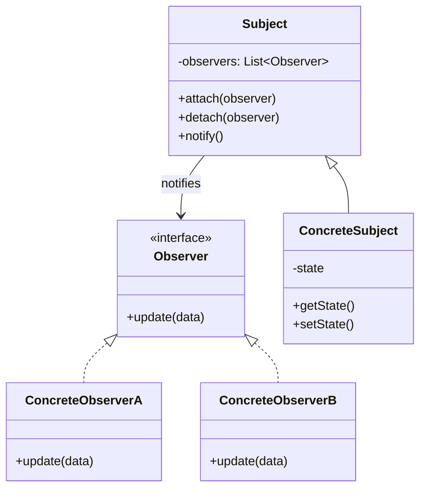

# Observer Pattern

> **Category**: `design-patterns / behavioral` · **Last Updated**: `2026-09-21` · **Difficulty**: `Intermediate`

---

## TL;DR

The Observer pattern defines a **one-to-many dependency** between objects so that when one object (the **subject**) changes state, all its dependents (**observers**) are notified and updated automatically. It's the backbone of event-driven programming.

---

## 📋 Overview

- **What**: A behavioral pattern that lets you define a subscription mechanism to notify multiple objects about events that happen to the object they're observing.
- **Why**: Decouples the event source from its consumers, allowing any number of observers to react to changes without the subject knowing about them.
- **When**: UI event systems, pub/sub messaging, reactive data streams, MVC architecture, notification systems.

---

## 🔑 Key Concepts

| Concept          | Description                                                      |
|------------------|------------------------------------------------------------------|
| Subject          | The object being observed; maintains list of observers           |
| Observer         | Interface for objects that should be notified of changes         |
| Concrete Subject | Stores state and notifies observers on state change              |
| Concrete Observer| Implements the update method to react to changes                 |
| Push vs Pull     | Push: subject sends data to observers. Pull: observers fetch it |

---

## 📐 Syntax / Visual Diagram



---

## 💻 Code Examples

### Python — Stock Price Tracker

```python
from abc import ABC, abstractmethod
from typing import Any

class Observer(ABC):
    @abstractmethod
    def update(self, subject: "Subject", **kwargs) -> None: ...

class Subject:
    def __init__(self):
        self._observers: list[Observer] = []
    
    def attach(self, observer: Observer) -> None:
        self._observers.append(observer)
    
    def detach(self, observer: Observer) -> None:
        self._observers.remove(observer)
    
    def notify(self, **kwargs) -> None:
        for observer in self._observers:
            observer.update(self, **kwargs)

class StockMarket(Subject):
    def __init__(self):
        super().__init__()
        self._prices: dict[str, float] = {}
    
    def set_price(self, symbol: str, price: float):
        old_price = self._prices.get(symbol, 0)
        self._prices[symbol] = price
        self.notify(symbol=symbol, price=price, change=price - old_price)

class PhoneAlert(Observer):
    def update(self, subject, **kwargs):
        if abs(kwargs["change"]) > 5:
            print(f"📱 ALERT: {kwargs['symbol']} → ${kwargs['price']:.2f} "
                  f"(Δ{kwargs['change']:+.2f})")

class Dashboard(Observer):
    def update(self, subject, **kwargs):
        print(f"📊 Dashboard: {kwargs['symbol']} = ${kwargs['price']:.2f}")

# Usage
market = StockMarket()
market.attach(PhoneAlert())
market.attach(Dashboard())

market.set_price("AAPL", 150.00)  # Dashboard updates
market.set_price("AAPL", 158.00)  # Both alert AND dashboard fire
```

### JavaScript — Event Emitter

```javascript
class EventEmitter {
  constructor() {
    this.listeners = {};
  }
  
  on(event, callback) {
    (this.listeners[event] ??= []).push(callback);
    return this;
  }
  
  off(event, callback) {
    this.listeners[event] = 
      this.listeners[event]?.filter(cb => cb !== callback);
    return this;
  }
  
  emit(event, ...args) {
    this.listeners[event]?.forEach(cb => cb(...args));
    return this;
  }
}

// Usage
const bus = new EventEmitter();
bus.on("userLogin", (user) => console.log(`Welcome, ${user}!`));
bus.on("userLogin", (user) => console.log(`Logging: ${user} logged in`));
bus.emit("userLogin", "Alice");
```

---

## ⚠️ Anti-Patterns

| ❌ Anti-Pattern                                 | ✅ Better Approach                                |
|-------------------------------------------------|---------------------------------------------------|
| Memory leaks from forgotten subscriptions       | Always unsubscribe/detach when observer is done   |
| Observer modifying subject state during update   | Keep updates side-effect-free on the subject       |
| Cascading notifications (observer triggers observer)| Use event queues or debouncing                 |
| Tight coupling via specific observer types      | Use generic observer interfaces                    |

---

## 🌍 Real-World Use Cases

| Use Case                      | Description                                                     |
|-------------------------------|-----------------------------------------------------------------|
| **UI Frameworks (React, Vue)**| Component re-renders when state changes                          |
| **Event Bus / Pub-Sub**       | Kafka, RabbitMQ, Redis Pub/Sub                                   |
| **MVC Architecture**          | Model notifies View of data changes                              |
| **DOM Event Listeners**       | `addEventListener` — the original Observer pattern               |
| **Webhooks**                  | Services notify subscribers via HTTP callbacks                    |
| **Reactive Streams**          | RxJS, Project Reactor — observables and subscribers              |

---

## ⚖️ Advantages vs Disadvantages

| ✅ Advantages                              | ❌ Disadvantages                                |
|--------------------------------------------|------------------------------------------------|
| Loose coupling between subject & observers | Can cause memory leaks if not cleaned up       |
| Open/Closed Principle — add observers freely| Notification order can be unpredictable        |
| Supports broadcast communication           | Debugging cascade of updates is difficult       |
| Dynamic relationships at runtime           | Can cause performance issues with many observers|

---

## 🔗 Related Topics

- [Strategy](strategy.md) — Observers can use different strategies for handling events
- [State](state.md) — State changes can trigger observer notifications
- [Decorator](decorator.md) — Can decorate observers with additional behavior
- [Event-Driven Architecture](../architecture/event-driven.md) — Architectural-scale Observer

---

## 📚 References

- [GeeksforGeeks — Observer Pattern](https://www.geeksforgeeks.org/observer-pattern-set-1-introduction/)
- [Refactoring Guru — Observer](https://refactoring.guru/design-patterns/observer)

---

*← Back to [Design Patterns](./README.md) · [Root Index](../README.md)*
