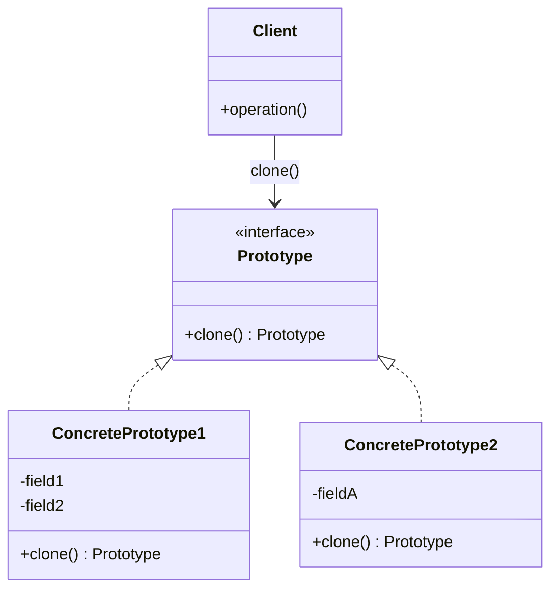

# Prototype Pattern

> **Category**: `design-patterns / creational` · **Last Updated**: `2026-09-21` · **Difficulty**: `Intermediate`

---

## TL;DR

The Prototype pattern creates new objects by **cloning/copying an existing object** (the prototype) rather than creating from scratch. This is useful when object creation is expensive or complex.

---

## 📋 Overview

- **What**: A creational pattern that lets you copy existing objects without making your code dependent on their classes.
- **Why**: Avoids the cost of creating objects from scratch when initialization is expensive (DB queries, API calls, complex computation).
- **When**: When classes to instantiate are specified at runtime, when object creation is costly, or when you need many objects that differ only slightly.

---

## 🔑 Key Concepts

| Concept           | Description                                                     |
|-------------------|-----------------------------------------------------------------|
| Prototype         | Interface declaring the `clone()` method                        |
| Concrete Prototype| Implements the cloning method                                    |
| Shallow Copy      | Copies field values; nested objects share references             |
| Deep Copy         | Recursively copies all objects, creating fully independent clones|
| Prototype Registry| Optional store of pre-built prototypes for lookup by key        |

---

## 📐 Syntax / Visual Diagram



---

## 💻 Code Examples

### Python

```python
import copy

class Document:
    def __init__(self, title: str, content: str, formatting: dict):
        self.title = title
        self.content = content
        self.formatting = formatting  # nested object
    
    def clone(self) -> "Document":
        """Deep copy — independent clone with no shared references."""
        return copy.deepcopy(self)
    
    def __str__(self):
        return f"'{self.title}' ({self.formatting.get('font', 'default')})"

# Usage — clone and customize instead of rebuilding
template = Document(
    title="Report Template",
    content="<placeholder>",
    formatting={"font": "Arial", "size": 12, "margins": [1, 1, 1, 1]}
)

# Clone and modify
q1_report = template.clone()
q1_report.title = "Q1 Financial Report"
q1_report.content = "Revenue increased by 15%..."

q2_report = template.clone()
q2_report.title = "Q2 Financial Report"

print(q1_report)  # 'Q1 Financial Report' (Arial)
print(q2_report)  # 'Q2 Financial Report' (Arial)
# template is unchanged
```

### Java

```java
public abstract class Shape implements Cloneable {
    public int x, y;
    public String color;
    
    public Shape() {}
    
    public Shape(Shape source) {
        this.x = source.x;
        this.y = source.y;
        this.color = source.color;
    }
    
    @Override
    public abstract Shape clone();
}

public class Circle extends Shape {
    public int radius;
    
    public Circle(Circle source) {
        super(source);
        this.radius = source.radius;
    }
    
    @Override
    public Circle clone() {
        return new Circle(this);
    }
}

// Usage
Circle original = new Circle();
original.x = 10; original.y = 20;
original.radius = 15; original.color = "red";

Circle cloned = original.clone();
cloned.color = "blue";
// original.color is still "red"
```

---

## ⚠️ Anti-Patterns

| ❌ Anti-Pattern                                 | ✅ Better Approach                                 |
|-------------------------------------------------|----------------------------------------------------|
| Shallow copy when deep copy is needed           | Use deep copy for objects with nested references   |
| Cloning objects with circular references blindly| Handle circular references explicitly               |
| Using Prototype when construction is cheap      | Only clone when creation is genuinely expensive     |

---

## 🌍 Real-World Use Cases

| Use Case                      | Description                                                     |
|-------------------------------|-----------------------------------------------------------------|
| **Document Templates**        | Clone a formatted template, then customize content              |
| **Game Object Spawning**      | Clone enemy/bullet prototypes instead of rebuilding each        |
| **Configuration Presets**     | Clone base configs and override specific settings               |
| **Undo/Redo Systems**        | Save object snapshots (clones) for state restoration            |
| **Cell Division Simulation** | Clone cells with mutations applied to clones                     |

---

## ⚖️ Advantages vs Disadvantages

| ✅ Advantages                              | ❌ Disadvantages                                |
|--------------------------------------------|------------------------------------------------|
| Avoids expensive initialization            | Deep cloning complex objects can be tricky     |
| Reduces subclassing                        | Circular references require special handling    |
| Runtime flexibility for object creation    | Must implement clone() on every class           |
| Hides concrete classes from client         | Shallow vs deep copy confusion                  |

---

## 🔗 Related Topics

- [Factory Method](factory-method.md) — Alternative creation strategy
- [Abstract Factory](abstract-factory.md) — Can use Prototypes internally
- [Builder](builder.md) — Step-by-step construction vs cloning

---

## 📚 References

- [GeeksforGeeks — Prototype Design Pattern](https://www.geeksforgeeks.org/prototype-design-pattern/)
- [Refactoring Guru — Prototype](https://refactoring.guru/design-patterns/prototype)

---

*← Back to [Design Patterns](./README.md) · [Root Index](../README.md)*
