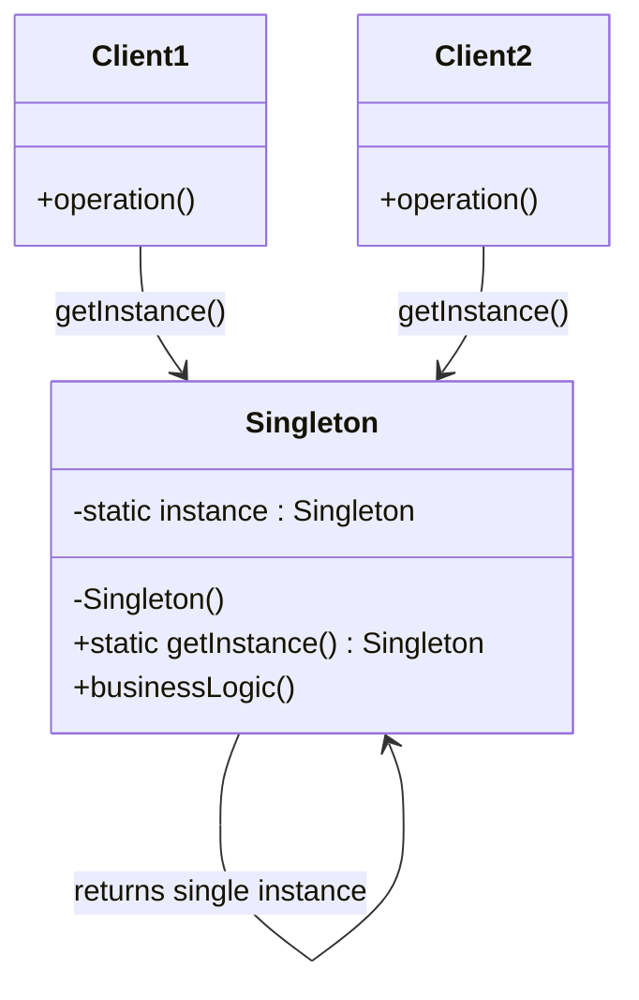

# Singleton Pattern

> **Category**: `design-patterns / creational` · **Last Updated**: `2026-09-21` · **Difficulty**: `Beginner`

---

## TL;DR

The Singleton pattern ensures a class has **only one instance** and provides a **global point of access** to it. It is one of the simplest and most widely used creational design patterns.

---

## 📋 Overview

- **What**: A creational pattern that restricts instantiation of a class to exactly one object.
- **Why**: Prevents resource conflicts when exactly one object is needed to coordinate actions across the system.
- **When**: Database connections, configuration stores, thread pools, caches, logging, hardware interface access.

### Core Principles

1. **Private Constructor** — prevents direct instantiation from outside the class.
2. **Static Instance** — holds the single instance at the class level.
3. **Static Access Method** — provides a global point of access (`getInstance()`).

---

## 🔑 Key Concepts

| Concept              | Description                                                         |
|----------------------|---------------------------------------------------------------------|
| Private Constructor  | Prevents external instantiation via `new`                           |
| Static Instance      | Holds the single instance at the class level                        |
| Lazy Initialization  | Instance created only when first requested (not at class load)      |
| Eager Initialization | Instance created at class load time (simpler but wastes resources)  |
| Thread Safety        | Must handle concurrent access in multi-threaded environments        |
| Double-Checked Lock  | Optimized thread-safe lazy initialization pattern                   |

---

## 📐 Syntax / Visual Diagram



---

## 💻 Code Examples

### Python — Thread-Safe Singleton (Double-Checked Locking)

```python
import threading

class Singleton:
    _instance = None
    _lock = threading.Lock()

    def __new__(cls, *args, **kwargs):
        if cls._instance is None:
            with cls._lock:
                # Double-checked locking
                if cls._instance is None:
                    cls._instance = super().__new__(cls)
        return cls._instance

    def __init__(self):
        # Guard against re-initialization
        if not hasattr(self, '_initialized'):
            self.value = None
            self._initialized = True

# Usage
s1 = Singleton()
s2 = Singleton()
s1.value = "Hello Singleton"

assert s1 is s2           # True — same instance
assert s2.value == "Hello Singleton"  # True — shared state
```

### Java — Thread-Safe Singleton (Bill Pugh Method)

```java
public class Singleton {
    // Private constructor prevents instantiation
    private Singleton() {}

    // Inner static helper class - not loaded until referenced
    private static class SingletonHelper {
        private static final Singleton INSTANCE = new Singleton();
    }

    public static Singleton getInstance() {
        return SingletonHelper.INSTANCE;
    }

    public void showMessage() {
        System.out.println("Hello from Singleton!");
    }
}

// Usage
Singleton s1 = Singleton.getInstance();
Singleton s2 = Singleton.getInstance();
// s1 == s2 → true
```

### JavaScript — Module Pattern (ES6+)

```javascript
class Singleton {
  constructor() {
    if (Singleton.instance) {
      return Singleton.instance;
    }
    this.timestamp = Date.now();
    Singleton.instance = this;
  }
}

// Usage
const s1 = new Singleton();
const s2 = new Singleton();
console.log(s1 === s2);             // true
console.log(s1.timestamp === s2.timestamp); // true
```

---

## ⚠️ Anti-Patterns

| ❌ Anti-Pattern                            | ✅ Better Approach                                     |
|--------------------------------------------|--------------------------------------------------------|
| Using Singleton for everything             | Only use when exactly one instance is truly required   |
| Global mutable state via Singleton         | Prefer dependency injection for testability            |
| Ignoring thread safety                     | Always use locks or language-level guarantees          |
| Tight coupling to `Singleton.getInstance()`| Inject the instance via constructor/parameter (DI)     |
| Subclassing a Singleton                    | Singletons should typically be `final`/sealed          |
| Using Singleton to replace global variables| Use proper scoping and dependency injection instead    |

---

## 🌍 Real-World Use Cases

| Use Case                  | Description                                                      |
|---------------------------|------------------------------------------------------------------|
| **Database Connection Pool** | Single pool shared across all request handlers reduces DB load |
| **Configuration Manager** | Application-wide settings loaded once and accessed globally      |
| **Logger**                | Centralized logging instance ensures consistent log formatting   |
| **Cache Manager**         | Single cache instance prevents redundant memory allocation       |
| **Thread Pool**           | One pool manages all worker threads efficiently                  |
| **Device Drivers**        | Hardware interface accessed through a single control point       |

### Detailed Scenario

**Scenario**: A microservice needs a single database connection pool shared across all request handlers.

**Problem**: Creating a new pool per request wastes resources and risks exceeding DB connection limits.

**Solution**: A Singleton `ConnectionPool` class initializes once and returns the same pool to every handler.

**Result**: Connection reuse reduced DB load by 60% and eliminated intermittent connection-limit errors.

---

## ⚖️ Advantages vs Disadvantages

| ✅ Advantages                              | ❌ Disadvantages                                 |
|--------------------------------------------|--------------------------------------------------|
| Controlled access to sole instance         | Can mask bad design (hidden dependencies)        |
| Reduced memory footprint                   | Difficult to unit test (global state)            |
| Lazy initialization possible              | Violates Single Responsibility Principle          |
| Global access point                        | Tight coupling throughout the application        |
| Thread-safe with proper implementation     | Problems in multi-threaded environments if done wrong |

---

## 🔗 Related Topics

- [Factory Method](factory-method.md) — Often used with Singleton to create the single instance
- [Abstract Factory](abstract-factory.md) — Can be implemented as a Singleton
- [Builder](builder.md) — Can use Singleton for the Director
- [Facade](facade.md) — Facade objects are often Singletons
- [State](state.md) — State objects can be Singletons

---

## 📚 References

- [GeeksforGeeks — Singleton Design Pattern](https://www.geeksforgeeks.org/singleton-design-pattern/)
- [Refactoring Guru — Singleton](https://refactoring.guru/design-patterns/singleton)
- [Gang of Four — Design Patterns (1994)](https://en.wikipedia.org/wiki/Design_Patterns)

---

*← Back to [Design Patterns](./README.md) · [Root Index](../README.md)*
