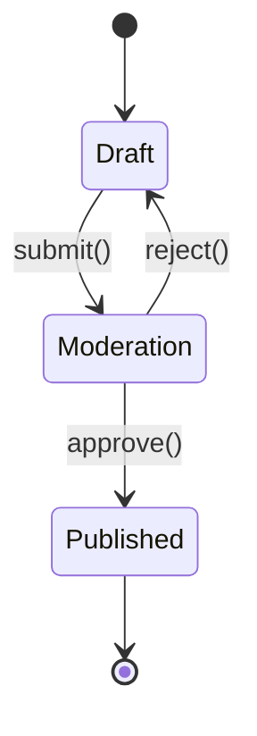
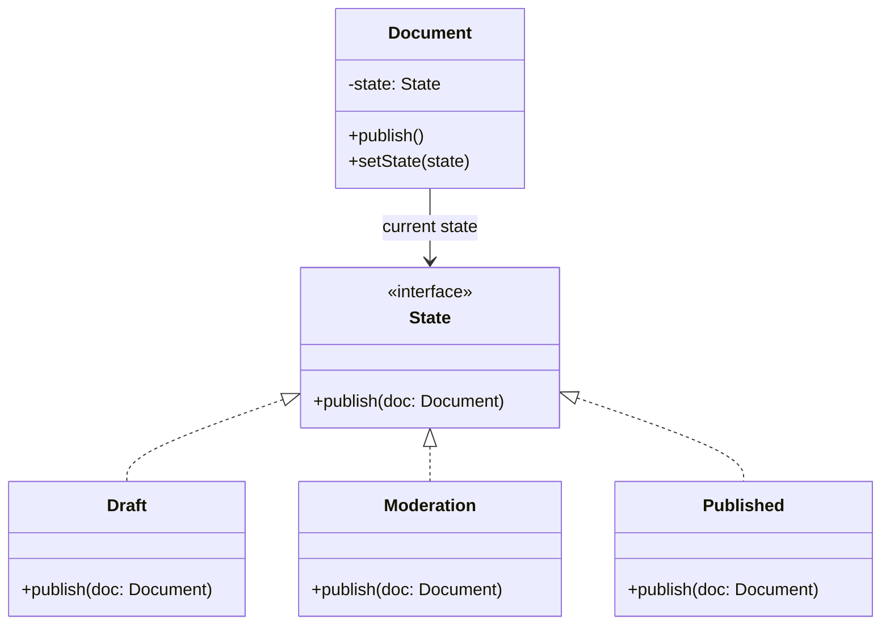

# State Pattern

> **Category**: `design-patterns / behavioral` · **Last Updated**: `2026-09-21` · **Difficulty**: `Advanced`

---

## TL;DR

The State pattern allows an object to **alter its behavior when its internal state changes**. The object will appear to change its class. It's a clean alternative to massive state-dependent conditionals.

---

## 📋 Overview

- **What**: A behavioral pattern that lets an object change its behavior when its internal state changes, by delegating behavior to the current state object.
- **Why**: Eliminates complex `if/elif/switch` blocks that check state before every operation, and makes state transitions explicit and maintainable.
- **When**: When an object's behavior depends on its state and it must change behavior at runtime, when operations have large conditional statements based on object state.

---

## 🔑 Key Concepts

| Concept        | Description                                                        |
|----------------|--------------------------------------------------------------------|
| Context        | The object whose behavior changes based on state                   |
| State Interface| Declares methods for state-specific behavior                        |
| Concrete States| Implement behavior specific to each state                           |
| State Transition| One state replaces itself with another in the context              |

---

## 📐 Syntax / Visual Diagram





---

## 💻 Code Examples

### Python — Document Publishing Workflow

```python
from abc import ABC, abstractmethod

class State(ABC):
    @abstractmethod
    def publish(self, doc: "Document") -> None: ...
    @abstractmethod
    def name(self) -> str: ...

class Draft(State):
    def publish(self, doc: "Document"):
        print("📝 Submitting draft for moderation...")
        doc.set_state(Moderation())
    def name(self) -> str: return "Draft"

class Moderation(State):
    def publish(self, doc: "Document"):
        if doc.current_user == "admin":
            print("✅ Admin approved — publishing!")
            doc.set_state(Published())
        else:
            print("⏳ Waiting for admin approval...")
    def name(self) -> str: return "Moderation"

class Published(State):
    def publish(self, doc: "Document"):
        print("📢 Already published — no action needed.")
    def name(self) -> str: return "Published"

class Document:
    def __init__(self, current_user: str = "author"):
        self._state = Draft()
        self.current_user = current_user
    
    def set_state(self, state: State):
        print(f"  State: {self._state.name()} → {state.name()}")
        self._state = state
    
    def publish(self):
        self._state.publish(self)

# Usage
doc = Document(current_user="author")
doc.publish()  # Draft → Moderation (submitted for review)

doc.current_user = "author"
doc.publish()  # ⏳ Waiting for admin approval

doc.current_user = "admin"
doc.publish()  # ✅ Moderation → Published

doc.publish()  # 📢 Already published
```

### Python — Vending Machine

```python
class VendingMachine:
    def __init__(self):
        self.state: State = IdleState()
        self.balance = 0.0
    
    def insert_coin(self, amount: float):
        self.state.insert_coin(self, amount)
    
    def select_product(self, product: str):
        self.state.select_product(self, product)
    
    def set_state(self, state):
        self.state = state

class IdleState:
    def insert_coin(self, machine, amount):
        machine.balance += amount
        print(f"💰 Inserted ${amount:.2f}. Balance: ${machine.balance:.2f}")
        machine.set_state(HasMoneyState())
    
    def select_product(self, machine, product):
        print("❌ Insert coins first!")

class HasMoneyState:
    def insert_coin(self, machine, amount):
        machine.balance += amount
        print(f"💰 Added ${amount:.2f}. Balance: ${machine.balance:.2f}")
    
    def select_product(self, machine, product):
        price = 1.50
        if machine.balance >= price:
            machine.balance -= price
            print(f"✅ Dispensing {product}! Change: ${machine.balance:.2f}")
            machine.set_state(IdleState())
        else:
            print(f"❌ Need ${price - machine.balance:.2f} more")

# Usage
vm = VendingMachine()
vm.select_product("Cola")   # ❌ Insert coins first!
vm.insert_coin(1.00)        # 💰 Inserted $1.00
vm.select_product("Cola")   # ❌ Need $0.50 more
vm.insert_coin(0.50)        # 💰 Added $0.50
vm.select_product("Cola")   # ✅ Dispensing Cola!
```

---

## ⚠️ Anti-Patterns

| ❌ Anti-Pattern                                 | ✅ Better Approach                                  |
|-------------------------------------------------|-----------------------------------------------------|
| Massive if/switch blocks checking state         | Delegate to State objects                            |
| State objects that know about all other states  | Each state only knows the states it transitions to  |
| Using State when there are only 2 states        | A simple boolean flag may suffice                    |
| Context exposing internal state to clients      | Clients should call context methods, not state methods|

---

## 🌍 Real-World Use Cases

| Use Case                      | Description                                                     |
|-------------------------------|-----------------------------------------------------------------|
| **TCP Connection States**     | LISTEN → SYN_RCVD → ESTABLISHED → CLOSE_WAIT → CLOSED          |
| **Document Workflows**        | Draft → Review → Approved → Published                            |
| **Vending Machines**          | Idle → Has Money → Dispensing → Idle                             |
| **Game Character States**     | Idle → Running → Jumping → Attacking → Dead                     |
| **Order Processing**          | Pending → Paid → Shipped → Delivered → Returned                 |
| **Media Players**             | Stopped → Playing → Paused → Stopped                             |

---

## ⚖️ Advantages vs Disadvantages

| ✅ Advantages                              | ❌ Disadvantages                                |
|--------------------------------------------|------------------------------------------------|
| Eliminates state-dependent conditionals    | Can be overkill for few states                  |
| Makes state transitions explicit           | Increased number of classes                     |
| Each state is independently testable       | Can be complex to trace through states          |
| Open/Closed Principle for new states       | State objects may have duplicate code            |

---

## 🔗 Related Topics

- [Strategy](strategy.md) — Similar structure but intent differs: Strategy swaps algorithms, State changes object behavior based on lifecycle
- [Observer](observer.md) — State changes can trigger observer notifications
- [Singleton](singleton.md) — State objects are often Singletons (stateless)

---

## 📚 References

- [GeeksforGeeks — State Design Pattern](https://www.geeksforgeeks.org/state-design-pattern/)
- [Refactoring Guru — State](https://refactoring.guru/design-patterns/state)

---

*← Back to [Design Patterns](./README.md) · [Root Index](../README.md)*
