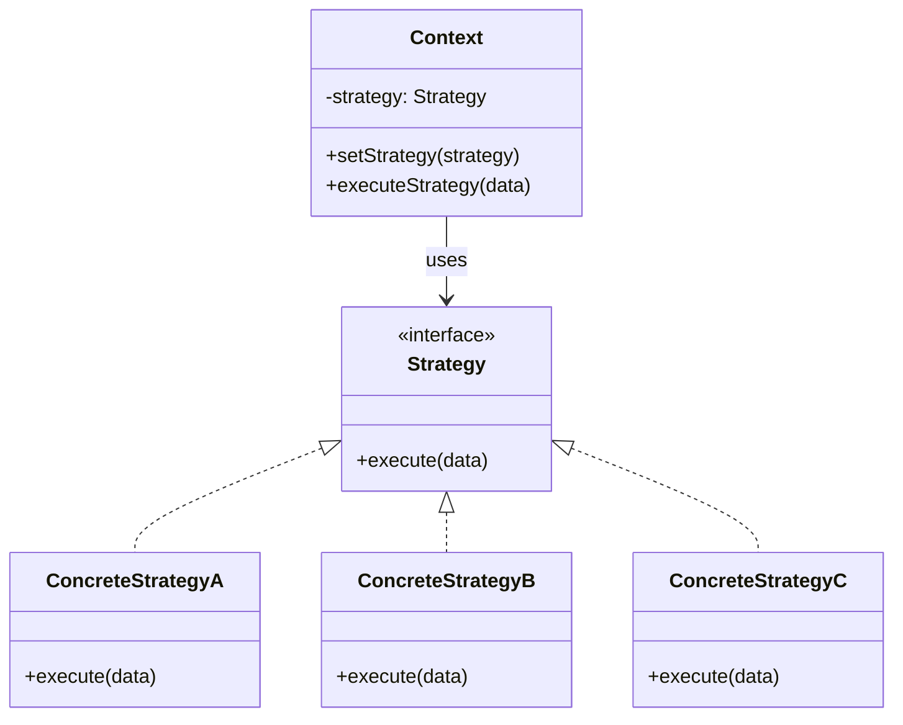

# Strategy Pattern

> **Category**: `design-patterns / behavioral` · **Last Updated**: `2026-09-21` · **Difficulty**: `Intermediate`

---

## TL;DR

The Strategy pattern defines a **family of algorithms**, encapsulates each one, and makes them **interchangeable**. It lets the algorithm vary independently from the clients that use it — swap behaviors at runtime without changing the class.

---

## 📋 Overview

- **What**: A behavioral pattern that lets you define a family of algorithms, put each of them into a separate class, and make their objects interchangeable.
- **Why**: Eliminates conditional statements (`if/elif/switch`) for selecting behavior, and makes it easy to add new algorithms without modifying existing code.
- **When**: When you have multiple algorithms for a specific task and want to switch between them at runtime, or when a class has a massive conditional that selects a variant of the same algorithm.

---

## 🔑 Key Concepts

| Concept            | Description                                                    |
|--------------------|----------------------------------------------------------------|
| Strategy Interface | Declares the method common to all strategies                    |
| Concrete Strategy  | Implements a specific algorithm                                 |
| Context            | Maintains a reference to the current strategy; delegates work   |
| Runtime Swapping   | Strategy can be changed at runtime via setter                   |

---

## 📐 Syntax / Visual Diagram



---

## 💻 Code Examples

### Python — Payment Processing

```python
from abc import ABC, abstractmethod

# Strategy interface
class PaymentStrategy(ABC):
    @abstractmethod
    def pay(self, amount: float) -> str: ...

# Concrete strategies
class CreditCardPayment(PaymentStrategy):
    def __init__(self, card_number: str):
        self.card_number = card_number
    
    def pay(self, amount: float) -> str:
        return f"💳 Paid ${amount:.2f} via Credit Card ending {self.card_number[-4:]}"

class PayPalPayment(PaymentStrategy):
    def __init__(self, email: str):
        self.email = email
    
    def pay(self, amount: float) -> str:
        return f"🅿️ Paid ${amount:.2f} via PayPal ({self.email})"

class CryptoPayment(PaymentStrategy):
    def __init__(self, wallet: str):
        self.wallet = wallet
    
    def pay(self, amount: float) -> str:
        return f"₿ Paid ${amount:.2f} via Crypto ({self.wallet[:8]}...)"

# Context
class ShoppingCart:
    def __init__(self):
        self.items: list[tuple[str, float]] = []
        self._payment_strategy: PaymentStrategy | None = None
    
    def add_item(self, name: str, price: float):
        self.items.append((name, price))
    
    def set_payment(self, strategy: PaymentStrategy):
        self._payment_strategy = strategy
    
    def checkout(self) -> str:
        total = sum(price for _, price in self.items)
        return self._payment_strategy.pay(total)

# Usage — swap strategies at runtime
cart = ShoppingCart()
cart.add_item("Laptop", 999.99)
cart.add_item("Mouse", 29.99)

cart.set_payment(CreditCardPayment("4111111111111234"))
print(cart.checkout())  # 💳 Paid $1029.98 via Credit Card ending 1234

cart.set_payment(PayPalPayment("user@example.com"))
print(cart.checkout())  # 🅿️ Paid $1029.98 via PayPal (user@example.com)
```

### Python — Sorting Strategies (Functional Style)

```python
from typing import Callable

# Strategies as functions (no class boilerplate needed)
def bubble_sort(data: list) -> list:
    arr = data.copy()
    for i in range(len(arr)):
        for j in range(len(arr) - i - 1):
            if arr[j] > arr[j + 1]:
                arr[j], arr[j + 1] = arr[j + 1], arr[j]
    return arr

def quick_sort(data: list) -> list:
    if len(data) <= 1: return data
    pivot = data[len(data) // 2]
    left = [x for x in data if x < pivot]
    mid = [x for x in data if x == pivot]
    right = [x for x in data if x > pivot]
    return quick_sort(left) + mid + quick_sort(right)

# Context using function references
class Sorter:
    def __init__(self, strategy: Callable):
        self.strategy = strategy
    
    def sort(self, data: list) -> list:
        return self.strategy(data)

data = [3, 1, 4, 1, 5, 9, 2, 6]
print(Sorter(bubble_sort).sort(data))  # [1, 1, 2, 3, 4, 5, 6, 9]
print(Sorter(quick_sort).sort(data))   # [1, 1, 2, 3, 4, 5, 6, 9]
```

---

## ⚠️ Anti-Patterns

| ❌ Anti-Pattern                                 | ✅ Better Approach                                  |
|-------------------------------------------------|-----------------------------------------------------|
| Giant if/elif/switch for selecting algorithms   | Use Strategy pattern with polymorphism              |
| Client must know all strategy implementations   | Use a factory or config to select strategies         |
| Over-abstracting simple conditionals            | Only use when you have 3+ variants                   |
| Creating strategies with shared mutable state   | Strategies should be stateless or immutable          |

---

## 🌍 Real-World Use Cases

| Use Case                     | Description                                                     |
|------------------------------|-----------------------------------------------------------------|
| **Payment Processing**       | Credit card, PayPal, crypto — same interface, different logic   |
| **Sorting Algorithms**       | Quick sort, merge sort, bubble sort — swap based on data size   |
| **Compression**              | ZIP, GZIP, BZIP2 — different algorithms, same compress/decompress interface |
| **Route Planning**           | Driving, walking, cycling, transit — different path algorithms  |
| **Validation Rules**         | Different validation strategies for different form fields        |
| **Authentication**           | OAuth, JWT, Basic Auth — same `authenticate()` interface        |
| **Discount Strategies**      | Percentage, fixed amount, BOGO — applied at checkout            |

---

## ⚖️ Advantages vs Disadvantages

| ✅ Advantages                              | ❌ Disadvantages                                |
|--------------------------------------------|------------------------------------------------|
| Eliminates conditional statements          | Clients must be aware of different strategies  |
| Easy to add new algorithms (OCP)           | Increased number of objects/classes             |
| Algorithms are independently testable      | Overkill for few simple variants                |
| Runtime swapping of algorithms             | Communication overhead between context & strategy |

---

## 🔗 Related Topics

- [State](state.md) — Looks similar but State changes behavior based on internal state
- [Observer](observer.md) — Can use strategies for different notification handling
- [Factory Method](factory-method.md) — Can create strategies
- [Bridge](bridge.md) — Similar structure but Bridge is structural
- [Decorator](decorator.md) — Changes the skin (external); Strategy changes the guts (internal)

---

## 📚 References

- [GeeksforGeeks — Strategy Pattern](https://www.geeksforgeeks.org/strategy-pattern-set-1/)
- [Refactoring Guru — Strategy](https://refactoring.guru/design-patterns/strategy)

---

*← Back to [Design Patterns](./README.md) · [Root Index](../README.md)*
