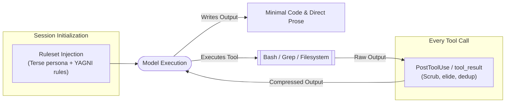

> 🔗 **GitHub Repository**: [JayPokale/Chisle](https://github.com/JayPokale/Chisle)

---

# 🪓 Chisle

> **Context and output token compressor for AI coding agents.** Your AI talks less, builds less, reads less, and delivers more — cutting token usage down to 44% of a bare model while eliminating fluff and unrequested boilerplate.

[](https://www.npmjs.com/package/chisle)
[](#-supported-agents)
[](package.json)
[](LICENSE)
[](https://github.com/JayPokale/Chisle)
[](https://github.com/JayPokale/Chisle)

---

## 🚀 Overview

Bare AI models often default to verbosity: producing speculative abstractions, unprompted boilerplate files, and lengthy conversational hedging. Furthermore, massive tool outputs (such as large grep or test runs) repeatedly bloat context windows across subsequent turns.

**Chisle** is a high-discipline, zero-dependency ruleset and hook engine that compresses on **three distinct axes**:

1. **Output Prose**: Strips hedging, filler phrases, and excessive conversational structure.
2. **Output Code**: Enforces a strict **YAGNI** (You Aren't Gonna Need It) ladder — prioritizing standard library primitives, in-place edits, and existing dependencies before creating new files or complex generic wrappers.
3. **Input Context**: Intercepts `PostToolUse` / `tool_result` hooks (Claude Code, Pi, OpenCode) to scrub, elide, and deduplicate noisy tool returns before they enter context.

---

## ⚡ Benchmark Results

Measured across 20 real coding tasks vs. bare models and competitor tools:

| Metric | Bare Baseline | Caveman | Ponytail | **Chisle** |
|---|--:|--:|--:|--:|
| **Coding Prompt Output** | 100% | 74% | 59% | **44%** |
| **Total 20-Task Bill** | 100% | 80% | 68% | **52%** |
| **Worst-Case Run** | 100% | 424% | 227% | **173%** |
| **Backfire Rate** | 0 / 20 | 6 / 20 | 8 / 20 | **1 / 20** |

---

## 🤖 Supported Agents

Chisle auto-configures rulesets across 11 AI coding environments:
- **Claude Code** (Plugin & marketplace)
- **Pi** (Global package / extension)
- **Cursor** (`.cursorrules` / `.cursor/rules`)
- **Windsurf** (`.windsurfrules`)
- **Cline** (`.clinerules`)
- **Kiro**
- **Codex CLI**
- **Gemini CLI**
- **GitHub Copilot CLI**
- **OpenCode**
- **Hermes**

---

## 📦 Installation & Setup

### Quick Install (One Command)

```bash
# Auto-detects installed coding agents and wires each one
npx chisle
```

Or via direct installation scripts:

```bash
# Linux / macOS
curl -fsSL https://raw.githubusercontent.com/JayPokale/Chisle/main/install.sh | bash

# Windows (PowerShell)
irm https://raw.githubusercontent.com/JayPokale/Chisle/main/install.ps1 | iex
```

### Dry Run & Scoped Setup

```bash
# Preview changes before writing anything
npx chisle --dry-run

# Configure only Claude Code or Pi
npx chisle --only claude
npx chisle --only pi

# Check accumulated token savings
npx chisle --stats

# Remove and restore original settings
npx chisle --uninstall
```

### Claude Code Plugin Installation

```bash
claude plugin marketplace add JayPokale/Chisle
claude plugin install chisle@chisle
```

---

## 🛠️ How It Works



---

## 🔗 Official Links

- **GitHub Repository**: [JayPokale/Chisle](https://github.com/JayPokale/Chisle)
- **Documentation & Benchmarks**: [chisle.jaypokale.me](https://chisle.jaypokale.me)
