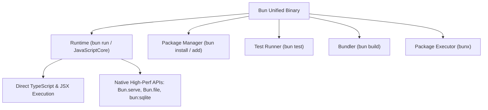

# Bun

> **Category**: `tools/free` · **Last Updated**: `2026-09-21` · **Difficulty**: `Beginner`

---

## TL;DR

Bun is a blazing-fast, all-in-one JavaScript and TypeScript runtime, package manager, test runner, and bundler written in Zig. Powered by Apple’s JavaScriptCore engine, Bun serves as a drop-in replacement for Node.js that runs TS/JSX natively and installs dependencies up to 25x faster than npm.

---

## 📋 Overview

- **What**: A unified developer toolchain combining a fast runtime (`bun run`), package manager (`bun install`), test runner (`bun test`), script executor (`bunx`), and bundler (`bun build`).
- **Why**: Node.js tooling stacks often require 1,000+ dependencies across disparate tools (`ts-node`, `tsc`, `esbuild`, `jest`, `npm`, `nodemon`). Bun unifies them into a single, high-speed native binary with sub-millisecond startup times.
- **When**: Greenfield TypeScript projects, CLI development, high-throughput microservices, monorepos seeking instant package installations, and fast local test suites.

---

## 🔑 Key Features & Tooling

| Feature | Description | Node.js Equivalent |
|---|---|---|
| **Native TypeScript/JSX** | Executes `.ts`, `.tsx`, and `.jsx` directly without compilation or ts-node. | `node` + `ts-node` / `tsx` |
| **Package Manager** | Global cache with hardlinks; installs packages 10–25x faster than npm. | `npm` / `pnpm` / `yarn` |
| **Test Runner** | Jest-compatible test runner with built-in mocking and snapshot testing. | `jest` / `vitest` |
| **Bundler** | High-performance tree-shaking bundler for browsers and node targets. | `esbuild` / `webpack` |
| **Built-in APIs** | Ultra-fast HTTP server, native SQLite driver, and zero-copy file I/O. | `express`, `sqlite3`, `fs` |

---

## 📐 Toolchain Architecture



---

## 💻 CLI Command Cheatsheet

```bash
# Package Management
bun install                     # Install dependencies from package.json
bun add react react-dom         # Add production dependencies
bun add -d typescript @types/node # Add dev dependencies
bun remove lodash               # Uninstall dependency
bun update                      # Update all dependencies

# Running & Executing
bun run index.ts                # Run a TypeScript file directly
bun run dev                     # Execute scripts in package.json
bun --watch server.ts           # Run with built-in hot-reloading
bunx prisma migrate dev         # Execute npx package binaries instantly

# Testing
bun test                        # Run all *.test.ts and *.spec.ts files
bun test --watch                # Run tests in watch mode
bun test auth.test.ts           # Run specific test file

# Bundling
bun build ./src/index.ts --outdir ./dist --target browser
```

---

## ⚡ High-Performance Native APIs

### 1. Ultra-Fast HTTP Server (`Bun.serve`)

```typescript
// server.ts
const server = Bun.serve({
  port: 3000,
  fetch(req) {
    const url = new URL(req.url);
    if (url.pathname === "/api/health") {
      return Response.json({ status: "ok", timestamp: Date.now() });
    }
    return new Response("Hello from Bun!", { status: 200 });
  },
});

console.log(`Listening on http://localhost:${server.port}`);
```

### 2. Built-In SQLite Database (`bun:sqlite`)

Zero external dependencies or compilation needed for embedded SQLite:

```typescript
import { Database } from "bun:sqlite";

const db = new Database(":memory:");
db.run("CREATE TABLE users (id INTEGER PRIMARY KEY, name TEXT, email TEXT)");

const insert = db.prepare("INSERT INTO users (name, email) VALUES (?, ?)");
insert.run("Alice", "alice@example.com");

const query = db.query("SELECT * FROM users WHERE name = ?");
const user = query.get("Alice");
console.log(user); // { id: 1, name: "Alice", email: "alice@example.com" }
```

### 3. Fast File I/O (`Bun.file`)

Zero-copy, lazy-loaded file access:

```typescript
// Reading files
const file = Bun.file("package.json");
const text = await file.text();
const json = await file.json();
const size = file.size;

// Writing files
await Bun.write("output.txt", "Fast file writing powered by Bun");
```

---

## ⚠️ Anti-Patterns & Migration Traps

| Trap | Why It Fails | Recommended Practice |
|---|---|---|
| **Legacy V8-Dependent C++ Addons** | Bun uses JavaScriptCore; native addons targeting V8 internal headers fail. | Use addons built on standard Node-API (`N-API`) which Bun fully supports. |
| **Checking in both `package-lock.json` and `bun.lockb`** | Dual lockfiles cause version drift between CI environments. | Standardize your team on `bun.lock` (text format in modern Bun) and gitignore others. |
| **Installing `ts-node` or `tsx`** | Redundant overhead; Bun natively executes TypeScript out-of-the-box. | Remove `ts-node` dependencies and run `bun index.ts` directly. |
| **Assuming 100% obscure Node internals** | Extremely niche or deprecated Node APIs may not yet be implemented. | Test compatibility with `bun test` and refer to Bun's Node compatibility docs. |

---

## 🔗 Related Resources

- **Official Website**: [bun.sh](https://bun.sh/)
- **Upstream Repository**: [github_repos/bun.md](../../github_repos/developer-tools/bun.md)
- **Official Documentation**: [bun.sh/docs](https://bun.sh/docs)

---

*← Back to [Free Tools](./README.md) · [Root Index](../../README.md)*
