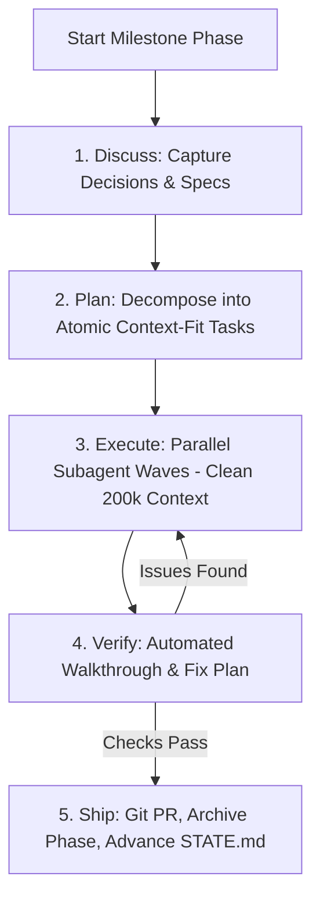

# GSD Core

> **Category**: `tools/free` · **Last Updated**: `2026-09-21` · **Difficulty**: `Intermediate`

---

## TL;DR

GSD Core (*Git. Ship. Done.*) is an open-source meta-prompting, context engineering, and spec-driven development framework for AI coding agents (Claude Code, Antigravity CLI, Cursor, Windsurf, Copilot, Codex). It eliminates AI "context rot" by running heavy research, planning, and execution inside fresh-context subagents while managing persistent project state.

---

## 📋 Overview

- **What**: An engineering framework and CLI tool (`@opengsd/gsd-core`) that structures AI-assisted software delivery through a disciplined, phase-based loop.
- **Why**: As AI agent conversations grow long, accumulated history causes "context rot"—hallucinations, forgotten instructions, truncated code, and compounding errors. GSD Core isolates execution into clean subagents and preserves project memory in structured repository artifacts.
- **When**: Any non-trivial feature delivery, multi-phase refactoring, or greenfield/brownfield project where reliability and verification matter more than one-shot guesswork.

---

## 🔑 Key Concepts

| Concept | Description |
|---|---|
| **Context Rot Elimination** | Offloads token-heavy research, code generation, and test runs to fresh 200k subagents, keeping orchestrator context clean. |
| **The 5-Step Phase Loop** | Systematic milestone cycle: **Discuss** → **Plan** → **Execute** → **Verify** → **Ship**. |
| **Persistent Artifacts** | Preserves state across agent sessions via repo-tracked markdown (`STATE.md`, `CONTEXT.md`, and phase plans). |
| **Parallel Execution Waves** | Executes independent task slices concurrently across multiple subagents with strict dependency gating. |
| **Verification Gate** | Mandatory code walkthrough and diagnostic fix loop before any phase is marked completed or merged. |
| **Cross-Runtime Support** | Works with Claude Code, Antigravity CLI, OpenCode, Kimi CLI, Kilo, Codex, Copilot, Cursor, and Windsurf. |

---

## 📐 The GSD 5-Step Phase Loop



---

## 💻 Installation & Quickstart

### 1. Install via npx

Run the interactive installer in your repository root:

```bash
npx @opengsd/gsd-core@latest
```

Select your agent runtime (Claude Code, Antigravity CLI, Cursor, Windsurf, Copilot, Codex, etc.) and choose local or global setup.

### 2. Initialize a Project

For greenfield (new) projects:

```bash
/gsd-new-project
```

For onboarding an existing codebase:

```bash
/gsd-onboard
```

### 3. Core Lifecycle Commands

| Command | Phase | Action |
|---|---|---|
| `/gsd-discuss` | **Discuss** | Surface requirements, architectural trade-offs, and implementation choices. |
| `/gsd-plan` | **Plan** | Research codebase, break goals into sub-tasks, and generate phased plan. |
| `/gsd-execute` | **Execute** | Spawn isolated subagents to build code and run tests in parallel waves. |
| `/gsd-verify` | **Verify** | Inspect diffs, run acceptance checks, and diagnose failures before closing phase. |
| `/gsd-ship` | **Ship** | Create git commit/PR, archive phase artifacts, and prepare next milestone. |

---

## ⚙️ How Context Engineering Works

Standard AI coding assistants suffer from cognitive degradation as turns increase:

```
Traditional Agent:
[Prompt] -> [File 1] -> [Error] -> [File 2] -> [Chat bloat] -> [CONTEXT ROT & DRIFT]

GSD Core Architecture:
Orchestrator (Lean Context + STATE.md)
  ├── Subagent 1 (Fresh 200k Context) -> Task A Plan & Code -> Returns Summary
  ├── Subagent 2 (Fresh 200k Context) -> Task B Tests & Build -> Returns Summary
  └── Verification Gate -> Validates Diff -> Updates STATE.md
```

---

## ⚠️ Anti-Patterns & Best Practices

| Anti-Pattern | Why It Fails | GSD Recommended Approach |
|---|---|---|
| **Single Monolithic Session** | Massive context windows degrade agent reasoning and produce truncated files. | Isolate heavy edits into dedicated subagent execution waves. |
| **Spec-Free Coding** | Jumping into code without agreed constraints yields rework and hallucinated architecture. | Run `/gsd-discuss` first to lock down decisions before code is generated. |
| **Skipping Verification** | Trusting agent assertions without runtime proof leads to broken commits. | Execute `/gsd-verify` to validate behavior before creating a PR. |
| **Manual File Copying** | Manually copying prompt files breaks cross-runtime adaptors and CLI hooks. | Always install and update via `npx @opengsd/gsd-core@latest`. |

---

## 🔗 Related Resources

- **Upstream Repository**: [open-gsd/gsd-core](https://github.com/open-gsd/gsd-core)
- **Local Documentation**: [github_repos/gsd-core.md](../../github_repos/ai-agents-skills/gsd-core.md)
- **npm Package**: [`@opengsd/gsd-core`](https://www.npmjs.com/package/@opengsd/gsd-core)
- **Related Tools**: [Ponytail](ponytail.md) · [Agent Skills](agent-skills.md) · [Graphify](graphify.md)

---

*← Back to [Free Tools](./README.md) · [Root Index](../../README.md)*
