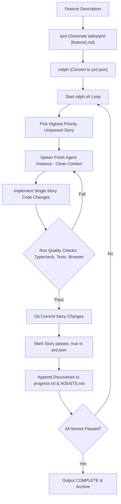

# Ralph

> **Category**: `tools/free` · **Last Updated**: `2026-09-21` · **Difficulty**: `Intermediate`

---

## TL;DR

Ralph is an autonomous AI agent harness that repeatedly executes AI coding tools ([Claude Code](https://docs.anthropic.com/en/docs/claude-code), [Amp](https://ampcode.com)) in a clean-context loop until all user stories in a PRD are verified and complete. Memory persists across iterations via git commits, `progress.txt`, and `prd.json`.

---

## 📋 Overview

- **What**: An autonomous execution loop and skill suite (based on Geoffrey Huntley's *Ralph pattern*) that drives AI coding agents one atomic story at a time.
- **Why**: AI agents struggle with long, complex feature builds when run in a single session—context bloat degrades reasoning, leading to broken builds and hallucinated progress. Ralph resets context to zero for every single task, using git and persistent state files as external long-term memory.
- **When**: Multi-story feature development, overnight autonomous coding tasks, full PRD execution, and refactoring large systems without human micro-management.

---

## 🔑 Key Concepts

| Concept | Description |
|---|---|
| **Fresh Context per Iteration** | Each iteration launches a fresh agent instance with 100% clean context; zero cumulative context decay. |
| **`prd.json` Task Contract** | Machine-readable user stories with acceptance criteria and boolean flags (`passes: false` → `passes: true`). |
| **`progress.txt` Memory Buffer** | Append-only file where each agent iteration logs codebase discoveries, architectural notes, and patterns. |
| **`AGENTS.md` Evolution** | Agents update project conventions and gotchas so subsequent runs immediately inherit learned wisdom. |
| **Hard Feedback Loops** | Every story requires automated verification (unit tests, typecheck, linting, or headless browser checks) before committing. |
| **Definite Stop Condition** | The loop terminates cleanly when all stories pass or maximum iterations are reached, outputting `<promise>COMPLETE</promise>`. |

---

## 📐 The Ralph Execution Loop



---

## 💻 Installation & Quickstart

### 1. Install Skills in Claude Code

Add the Ralph marketplace to Claude Code:

```bash
/plugin marketplace add snarktank/ralph
/plugin install ralph-skills@ralph-marketplace
```

Or install the shell loop directly into your project:

```bash
mkdir -p scripts/ralph
curl -o scripts/ralph/ralph.sh https://raw.githubusercontent.com/snarktank/ralph/main/ralph.sh
curl -o scripts/ralph/CLAUDE.md https://raw.githubusercontent.com/snarktank/ralph/main/CLAUDE.md
chmod +x scripts/ralph/ralph.sh
```

### 2. The 3-Step Workflow

#### Step 1: Create a PRD
Prompt your AI agent:
```
Load the prd skill and create a PRD for: Add team member invite flow with email validation
```
Answer clarifying questions; outputs to `tasks/prd-team-invites.md`.

#### Step 2: Convert to Ralph Format (`prd.json`)
```
Load the ralph skill and convert tasks/prd-team-invites.md to prd.json
```

#### Step 3: Run the Autonomous Loop
Run with Claude Code or Amp:

```bash
# Using Claude Code (runs up to 10 iterations by default)
./scripts/ralph/ralph.sh --tool claude 15

# Using Amp
./scripts/ralph/ralph.sh --tool amp 15
```

---

## ⚙️ Example `prd.json` Structure

```json
{
  "project": "AcmeApp",
  "branchName": "feature/team-invites",
  "userStories": [
    {
      "id": "STORY-01",
      "title": "Add invitations table and Prisma migration",
      "acceptanceCriteria": [
        "Create Invitation schema with email, token, expiresAt",
        "Generate and run prisma migration",
        "npm run typecheck passes"
      ],
      "passes": true
    },
    {
      "id": "STORY-02",
      "title": "Create POST /api/invitations route",
      "acceptanceCriteria": [
        "Validates email format via Zod",
        "Generates crypto token with 7-day expiration",
        "Unit tests pass: npm test tests/api/invitations.test.ts"
      ],
      "passes": false
    }
  ]
}
```

---

## ⚠️ Anti-Patterns & Traps

| Anti-Pattern | Why It Fails | Recommended Fix |
|---|---|---|
| **Oversized Stories** | Stories like "build entire auth" exceed a single context window, triggering hallucinations. | Split into atomic stories (schema → route → UI → error states). |
| **No Automated Checks** | If stories don't require tests/typechecks, broken code compounds across iterations. | Always include `npm test` or `npm run typecheck` in acceptance criteria. |
| **Ignoring Frontend Verification** | Visual regressions slip past unit tests unnoticed. | Require "Verify in browser using dev-browser skill" on all UI stories. |
| **Not Committing per Story** | Blurring commits makes it impossible to isolate which story introduced a bug. | Ralph enforces atomic git commits after each story passes. |

---

## 🔗 Related Resources

- **Upstream Repository**: [snarktank/ralph](https://github.com/snarktank/ralph)
- **Local Documentation**: [github_repos/ralph.md](../../github_repos/ai-agents-skills/ralph.md)
- **Interactive Flowchart**: [snarktank.github.io/ralph](https://snarktank.github.io/ralph/)
- **Related Tools**: [GSD Core](gsd-core.md) · [Agent Skills](agent-skills.md) · [Ponytail](ponytail.md)

---

*← Back to [Free Tools](./README.md) · [Root Index](../../README.md)*
