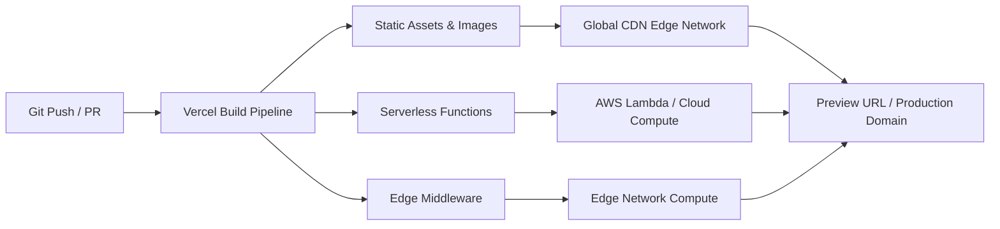

# Vercel

> **Category**: `tools/paid` · **Last Updated**: `2026-09-21` · **Difficulty**: `Beginner`

---

## TL;DR

Vercel is the premier frontend cloud and serverless deployment platform for Next.js, React, Vue, Svelte, and modern web applications. It automates global edge deployments, preview URLs on every Git push, serverless compute, and performance analytics with a free Hobby tier and commercial Pro/Enterprise plans.

---

## 📋 Overview

- **What**: A cloud infrastructure platform tailored for frontend developers and full-stack web frameworks, created by the creators of Next.js.
- **Why**: Traditional cloud infrastructure (AWS, GCP) requires complex configuration of VPCs, load balancers, SSL certificates, build pipelines, and CDN caches. Vercel abstracts this into an effortless `git push` workflow with instant global edge deployment.
- **When**: Deploying Jamstack and SSR web apps (Next.js, Nuxt, SvelteKit, Astro), creating pull request preview environments, running edge middleware, and deploying serverless APIs.

---

## 🔑 Key Features

| Feature | Description |
|---|---|
| **Git-Integrated Previews** | Generates an isolated, immutable preview URL for every branch and Pull Request automatically. |
| **Global Edge Network** | Serves static assets, edge middleware, and ISR pages from data centers closest to the visitor. |
| **Serverless & Edge Functions** | Automatically converts API routes (`/api/*`) into auto-scaling, scale-to-zero serverless microservices. |
| **Next.js Deep Integration** | Native support for Incremental Static Regeneration (ISR), Image Optimization, and React Server Components. |
| **Vercel CLI** | Local development emulation (`vercel dev`) and terminal-driven deployments (`vercel --prod`). |

---

## 💰 Pricing & Subscription Tiers

| Tier | Price | Best For | Commercial Use | Key Limits & Features |
|---|---|---|---|---|
| **Hobby** | **$0** (Free forever) | Personal, open-source & non-commercial projects | ❌ Non-commercial only | 100GB bandwidth, 100GB-hrs serverless execution, unlimited preview deploys, 10s function timeouts. |
| **Pro** | **$20** / seat / mo | Startups, agencies, & commercial products | ✅ Commercial allowed | 1TB bandwidth, 1,000GB-hrs serverless, team collaboration, preview comments, 60s function timeouts, password protection. |
| **Enterprise** | Custom | High-volume organizations & regulated industries | ✅ Enterprise | 99.99% SLA, SSO/SAML, 900s function timeouts, custom isolated infrastructure, dedicated support. |

---

## 📐 Deployment Architecture



---

## 💻 CLI Quickstart & Workflow

### 1. Install & Authenticate

```bash
npm i -g vercel

# Log in to your Vercel account
vercel login
```

### 2. Local Development

Emulate the Vercel production environment (including environment variables, edge middleware, and serverless functions) locally:

```bash
# Pull remote environment variables into .env.local
vercel env pull

# Run local development server
vercel dev
```

### 3. Deploy from Terminal

```bash
# Deploy a preview branch
vercel

# Deploy directly to production
vercel --prod
```

---

## ⚙️ Configuration Recipe (`vercel.json`)

Customize build settings, headers, redirects, and function memory:

```json
{
  "buildCommand": "npm run build",
  "outputDirectory": "dist",
  "cleanUrls": true,
  "trailingSlash": false,
  "headers": [
    {
      "source": "/(.*)",
      "headers": [
        { "key": "X-Content-Type-Options", "value": "nosniff" },
        { "key": "X-Frame-Options", "value": "DENY" }
      ]
    }
  ],
  "functions": {
    "api/**/*.ts": {
      "memory": 1024,
      "maxDuration": 30
    }
  }
}
```

---

## ⚠️ Anti-Patterns & Pitfalls

| Trap | Risk | Recommended Best Practice |
|---|---|---|
| **Commercial Use on Hobby Plan** | Violates Vercel Terms of Service; accounts risk suspension. | Upgrade to the Pro plan ($20/seat) as soon as a site generates revenue or serves a business. |
| **Long-Running Compute Tasks** | Serverless functions timeout (10s on Hobby, 60s on Pro) and incur high invocation costs. | Offload long tasks (video rendering, heavy ML) to background job queues (Inngest, Trigger.dev, AWS SQS). |
| **Uncached Dynamic Database Calls** | Excessive database hits in serverless functions cause high latency and database connection pool exhaustion. | Use connection poolers (Neon, Prisma Accelerate, Supabase pooler) and cache responses via ISR / Cache-Control headers. |
| **Checking in Production Secrets** | Exposing API keys in git history. | Store secrets in Vercel Project Settings and pull locally via `vercel env pull`. |

---

## 🔗 Related Resources

- **Official Website**: [vercel.com](https://vercel.com/)
- **Upstream CLI Documentation**: [github_repos/vercel.md](../../github_repos/vercel.md)
- **Official Documentation**: [vercel.com/docs](https://vercel.com/docs)
- **Related Tools**: [Launch SEO Checklist](../../best-practices/seo-checklist.md) · [Bun](../free/bun.md)

---

*← Back to [Paid Tools](./README.md) · [Root Index](../../README.md)*
