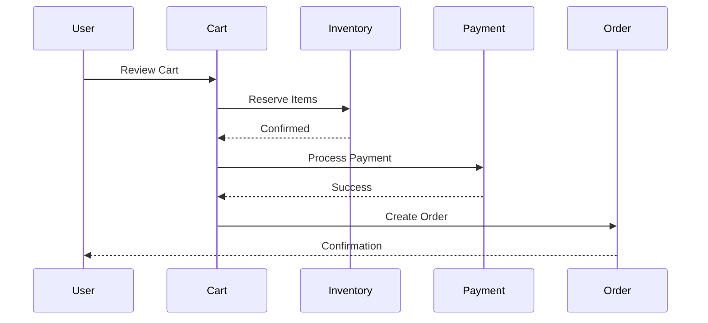

<![CDATA[# E-Commerce Checkout Flow

> **Category**: `use-cases` · **Last Updated**: `2026-09-21` · **Difficulty**: `Advanced`

---

## TL;DR

A production checkout flow involves cart validation, inventory reservation, payment processing, and order confirmation — each needing idempotency and failure handling.

---

## 📐 Flow Diagram

```mermaid
sequenceDiagram
    participant User
    participant Cart
    participant Inventory
    participant Payment
    participant Order

    User->>Cart: Review Cart
    Cart->>Inventory: Reserve Items
    Inventory-->>Cart: Confirmed
    Cart->>Payment: Process Payment
    Payment-->>Cart: Success
    Cart->>Order: Create Order
    Order-->>User: Confirmation
```

---

*← Back to [Use Cases](./README.md) · [Root Index](../README.md)*
]]>
